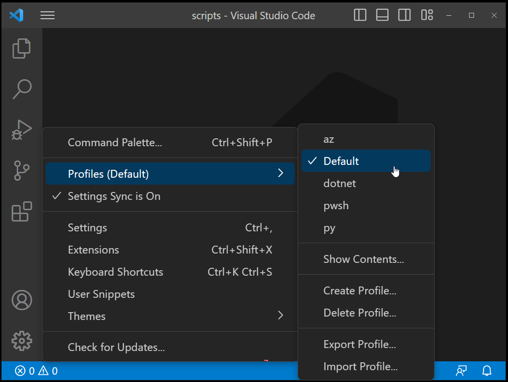

## Motivation

I now work with Visual Studio Code for several years in many different workloads:
- Azure scripting in Azure CLI and PowerShell
- .NET development
- Python development
- Go development
- Bash scripting
- ...

With that I collected a number of extensions in Visual Studio Code - before writing this article : 53 - which makes startup of VS Code slow, especially when I already have a lot of going on on my machine and much more so with the machine behind the corporate let-inspect-just-everything proxy.

When learning about [VS Code profiles](https://code.visualstudio.com/docs/editor/profiles) I thought that I could create a utility that helps me setup extensions tailored to my various editing workloads.

## Prerequisites

I did not yet figure out how to manage profiles programmatically, hence before running the script the profiles touched by the script need to be created first:



## Automation Script

This bare bone script (no checkings, no safety nets) is capable of removing installed extensions on all profiles specified and then install extensions for those profiles:

```PowerShell
param(
    [string] $ProfilePattern = ".*",
    [switch] $Clear,
    [switch] $Install
)

$config = @{
    "Default" = @("humao.rest-client")
    "pwsh"    = @("ms-vscode.powershell")
    "py"      = @("ms-python.python")
    "az"      = @("humao.rest-client", "ms-vscode.azure-account", "ms-vscode.azurecli")
    "dotnet"  = @("humao.rest-client", "ms-dotnettools.csharp")
}

if ($Clear) {
    foreach ($p in ($config.Keys | ? { $_ -match $ProfilePattern })) {
        Write-Host "clear profile" $p
        code --profile $p --list-extensions | % { code --profile $p --uninstall-extension $_ --force }
    }
}

if ($Install) {
    foreach ($p in ($config.Keys | ? { $_ -match $ProfilePattern })) {
        Write-Host "install profile" $p "extensions"
        foreach ($e in $config[$p]) {
            code --profile $p --install-extension $e --force
        }
    }
}
```

### Usage

| | |
| --- | --- |
| `setupVSCodeExtensions.ps1 -Clear` | remove extensions for all specified profiles |
| `setupVSCodeExtensions.ps1 -Install` | install extensions on all specified profiles |
| `setupVSCodeExtensions.ps1 -Clear -Install` | remove and then install extensions on all specified profiles |
| `setupVSCodeExtensions.ps1 -Clear -Install -ProfilePattern "pwsh"` | remove and then install extensions for `pwsh` profile |

## Note on Settings Sync

As I have [settings sync](https://code.visualstudio.com/docs/editor/settings-sync) activated on all my VS Code instances, above setup was synchronized from my Windows box configuration, where I orignally ran the script, to my other Windows and Linux boxes and VMs.