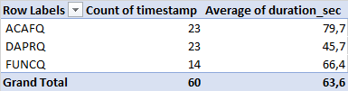
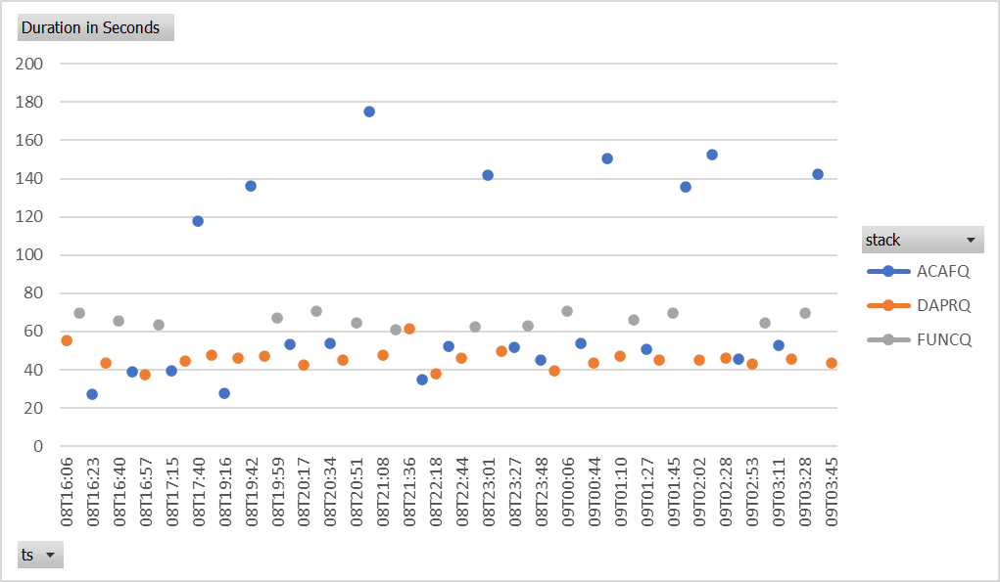
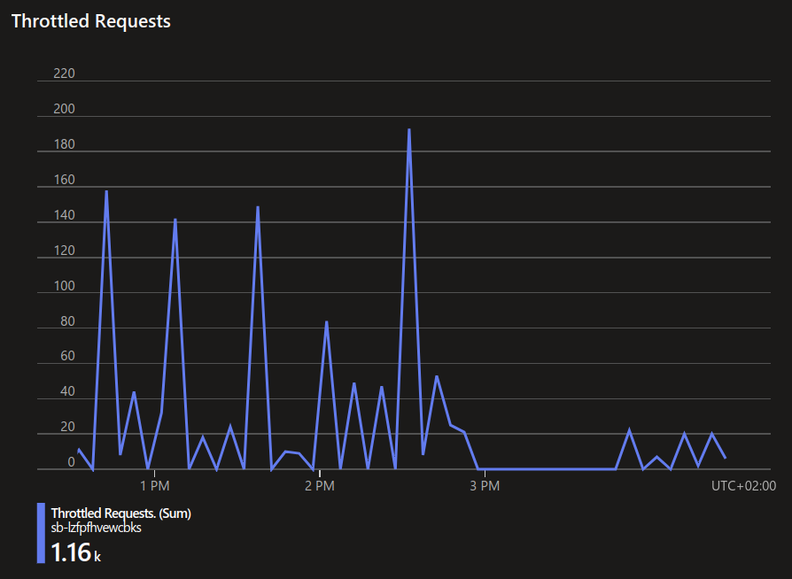

## TL;DR

In this post I show

- (mainly) how .NET **Azure Functions** (in the 2 currently available hosting options on **Azure Container Apps**) can be compared to a **ASP.NET Dapr** application in terms of asynchronous messaging throughput
- some learnings when deploying the 3 variants on ACA (=Azure Container Apps):
  - Azure Functions in a container on ACA, applying KEDA scaling
  - Azure Functions on ACA, leaving scaling up to the platform
  - ASP.NET in a container on ACA using Dapr sidecar, apply KEDA scaling

_jump to [results](#results)_

> Although the [sample repo](https://github.com/KaiWalter/message-distribution) additional to **Bash/Azure CLI** contains a deployment option with **Azure Developer CLI**, I never was able to sustain stable deployment with this option while Azure Functions on Container Apps was in preview.

## Motivation

[Azure Container Apps hosting of Azure Functions](https://learn.microsoft.com/en-us/azure/azure-functions/functions-container-apps-hosting) is a way to host Azure Functions directly in Container Apps - additionally to App Service with and without containers. This offering also adds some Container Apps built-in capabilities like the [Dapr](https://dapr.io/) microservices framework which would allow for mixing microservices workloads on the same environment with Functions.

Running a sufficiently big workload already with Azure Functions inside containers on Azure Container Apps for a while, I wanted to see how both variants compare in terms of features and above all : scaling.

With [another environment](https://customers.microsoft.com/en-us/story/1336089737047375040-zeiss-accelerates-cloud-first-development-on-azure-and-streamlines-order-processing) we heavily rely on **Dapr** for synchronous invocations as well as asynchronous message processing. Hence additionally I wanted to see whether one of the frameworks promoted by Microsoft - Azure Functions host with its bindings or Dapr with its generic components and the sidecar architecture - substantially stands out in terms of throughput.

## Solution Overview

The test environment can be deployed from this [repo](https://github.com/KaiWalter/message-distribution) - `README.md` describes the steps required.

### Approach

To come to a viable comparision, I applied these aspects:

- logic for all contenders is written in **C# / .NET 7**
- all contenders need to process the **exact same volume** and structure of payloads - which is generated once and then sent to them for processing
- test payload (10k messages by default) is send on a queue and **scheduled to exactly the same time** to force the stack, to deal with the amount at once
- both Functions variants are based on **.NET isolated worker**, as Functions on Container Apps only support this model
- all 3 variantes run staggered, not at the same time, on the same Container Apps environment, hence same region, same nodes, same resources ...

### Limitations

- Only **Service Bus queues** are tested. Of course, a scenario like this can also be achieved with pub/sub Service Bus **topics** and subscriptions. However in our enterprise workloads, where we apply this pattern, we work with queues as these allow a dedicated dead-lettering at each stage of the process - compared to topics, where moving messages from _dead-letter_ to _active_ results in all subscribers (if not explicitly filtered) receivng these messsages again.
- Currently not all capabilities of the contesting stacks - like Dapr bulk message processing - are maxed out. Hence there is obviously still some potential for improving individual throughput.

### Measuring Throughput

Throughput is measured by substracting the timestamp of the last message processed from the timestamp of the first message processed - for a given scheduling timestamp. A generic query to Application Insights with `$TESTPREFIX` representing one of the _codes_ above and `$SCHEDULE` refering to the scheduling timestamp for a particular test run:

```
query="requests | where cloud_RoleName matches regex '$TESTPREFIX(dist|recv)' | where name != 'Health' and name !startswith 'GET' | where timestamp > todatetime('$SCHEDULE') | where success == true | summarize count(),sum(duration),min(timestamp),max(timestamp) | project count_, runtimeMs=datetime_diff('millisecond', max_timestamp, min_timestamp)"
```

### Evaluating Scaling

While above query is used in the automated testing and recording process, I used this type of query ...

```
requests
| where cloud_RoleName startswith "func"
| where name != "Health"
| where timestamp > todatetime('2022-11-03T07:09:26.9394443Z')
| where success == true
| summarize count() by cloud_RoleInstance, bin(timestamp, 15s)
| render columnchart
```

... to see whether the platform / stack scales in an expected pattern, ...


... which pointed me to a strange scaling lag for Azure Functions on ACA:


Microsoft Product Group looked into this observation and provided an explanation in this [GitHub issue](https://github.com/Azure/azure-functions-on-container-apps/issues/33). When conducting the final battery of tests in October'23 this behavior was partially gone (see results below) and Functions scaled as to be expected.

### Solution Elements

- a `Generate` in Function App `testdata` generates a test data payload (e.g. with 10k orders) and puts it in a blob storage
- one of the `PushIngress...` functions in the very same Function App then can be triggered to schedule all orders at once on an ingress Service Bus queue - either for Functions or for Dapr
- each of the contestants has a `Dispatch` method which picks the payload for each order from the ingress queue, inspects it and puts it either on a queue for "Standard" or "Express" orders
- then for these order types there is a separate `Receiver` function which finally processes the dispatched message


C# project names and queues use a consistent coding for each contestant:

| code used for solution elements | implementation and deployment approach                                                                                             |
| ------------------------------- | ---------------------------------------------------------------------------------------------------------------------------------- |
| **ACAF**                        | .NET [Azure Functions on ACA deployment](https://learn.microsoft.com/en-us/azure/azure-functions/functions-container-apps-hosting) |
| **DAPR**                        | ASP.NET with Dapr in a container on ACA                                                                                            |
| **FUNC**                        | .NET Azure Functions in a container on ACA                                                                                         |

#### Dispatcher

As .NET isolated does not support multiple outputs for Functions, an optional message output is required to either put message into `StandardMessage` or `ExpressMessage`:

```csharp
using Azure.Messaging.ServiceBus;
using Microsoft.Azure.Functions.Worker;
using Microsoft.Extensions.Logging;
using Models;
using System.Text;
using System.Text.Json;

namespace funcdistributor
{
    public class Dispatch
    {
        [Function("Dispatch")]
        public DispatchedOutput Run(
            [ServiceBusTrigger("q-order-ingress-func", Connection = "SERVICEBUS_CONNECTION")] string ingressMessage,
            ILogger log)
        {
            ArgumentNullException.ThrowIfNull(ingressMessage, nameof(ingressMessage));

            var order = JsonSerializer.Deserialize<Order>(ingressMessage);

            ArgumentNullException.ThrowIfNull(order, nameof(ingressMessage));

            var outputMessage = new DispatchedOutput();

            switch (order.Delivery)
            {
                case Delivery.Express:
                    outputMessage.ExpressMessage = new ServiceBusMessage(Encoding.UTF8.GetBytes(JsonSerializer.Serialize(order)))
                    {
                        ContentType = "application/json",
                        MessageId = order.OrderId.ToString(),
                    };
                    break;
                case Delivery.Standard:
                    outputMessage.StandardMessage = new ServiceBusMessage(Encoding.UTF8.GetBytes(JsonSerializer.Serialize(order)))
                    {
                        ContentType = "application/json",
                        MessageId = order.OrderId.ToString(),
                    };
                    break;
                default:
                    log.LogError($"invalid Delivery type: {order.Delivery}");
                    break;
            }

            return outputMessage;
        }
    }

    public class DispatchedOutput
    {
        [ServiceBusOutput("q-order-express-func", Connection = "SERVICEBUS_CONNECTION")]
        public ServiceBusMessage? ExpressMessage { get; set; }

        [ServiceBusOutput("q-order-standard-func", Connection = "SERVICEBUS_CONNECTION")]
        public ServiceBusMessage? StandardMessage { get; set; }
    }
}
```

For Dapr this dispatcher is implemented with minimal API just in the top-level file `Program.cs` - a very concise way almost in Node.js style:

```csharp
app.MapPost("/q-order-ingress-dapr", async (
    [FromBody] Order order,
    [FromServices] DaprClient daprClient
    ) =>
{
    switch (order.Delivery)
    {
        case Delivery.Express:
            await daprClient.InvokeBindingAsync("q-order-express-dapr", "create", order);
            break;
        case Delivery.Standard:
            await daprClient.InvokeBindingAsync("q-order-standard-dapr", "create", order);
            break;
    }

    return Results.Ok(order);
});
```

#### Receiver

in Functions:

```csharp
using Microsoft.Azure.Functions.Worker.Http;
using Microsoft.Azure.Functions.Worker;
using Microsoft.Extensions.Logging;
using Models;
using System.Text.Json;
using System;

namespace acafrecvexp
{
    public class Receiver
    {
        [Function("Receiver")]
        public void Run(
            [ServiceBusTrigger("q-order-express-acaf", Connection = "SERVICEBUS_CONNECTION")] string ingressMessage,
            FunctionContext executionContext
            )
        {
            var logger = executionContext.GetLogger("Receiver");

            ArgumentNullException.ThrowIfNull(ingressMessage, nameof(ingressMessage));

            var order = JsonSerializer.Deserialize<Order>(ingressMessage);

            ArgumentNullException.ThrowIfNull(order, nameof(order));

            logger.LogInformation("{Delivery} Order received {OrderId}", order.Delivery, order.OrderId);
        }
    }
}
```

in Dapr with minimal API:

```csharp
app.MapPost("/q-order-express-dapr", (
    ILogger<Program> log, 
    [FromBody] Order order
    ) => 
{
    log.LogInformation("{Delivery} Order received {OrderId}", order.Delivery, order.OrderId);
    return Results.Ok();
});
```

#### Scaling

For the Functions and Dapr Container App, a scaling rule can be set. For Functions on ACA this is handled by the platform.

```
      scale: {
        minReplicas: 1
        maxReplicas: 10
        rules: [
          {
            name: 'queue-rule'
            custom: {
              type: 'azure-servicebus'
              metadata: {
                queueName: entityNameForScaling
                namespace: serviceBusNamespace.name
                messageCount: '100'
              }
              auth: [
                {
                  secretRef: 'servicebus-connection'
                  triggerParameter: 'connection'
                }
              ]
            }

          }
        ]
      }

```

> This setting makes ACA scale replicas up when there are more than 100 messages in active queue.

----

## Results<a name="results"></a>

A first batch of tests in August'23 revealed no substantial disparity between the stacks:


To capture the final results in October'23, I ...

- upgraded dependencies of the .NET projects (e.g. to Dapr 1.11)
- switched from Azure Service Bus Standard Tier to Premium because of that throttling issue explained below, which imho gave the whole scenario a major boost

After these upgrades and probably backend rework done by Microsoft now a much clearer spread of average durations can be seen: Dapr is obviously handling the processing faster than Functions in Container on ACA and then (currently) Functions on ACA shows the worst performance in average:



Looking on the time dimension one can see that Functions on ACA has a wider spread of durations - even processing faster than Dapr at some points:



I am sure, that throughput of all variants can be improved by investing more time in measuring and fine tuning. My approach was to see what I can get out of the environment with a feasible amount of effort.

----

## Nuggets and Gotchas

Appart from the plain throughput evaluation above, I want to add the issues I stumbled over along the way - I guess this is the real "meat" of this post:

### Deploying Container Apps with no App yet built

When deploying infrastructure without the apps yet being build, a Functions on ACA already needs a suitable container image to spin up. I solved this in **Bicep** evaluating whether a ACR container image name was provided or not. Additional challenge then is that _DOCKER_REGISTRY..._ credentials are required for the final app image but not for the tempory dummy image.

```
...
var effectiveImageName = imageName != '' ? imageName : 'mcr.microsoft.com/azure-functions/dotnet7-quickstart-demo:1.0'

var appSetingsBasic = [
  {
    name: 'AzureWebJobsStorage'
    value: 'DefaultEndpointsProtocol=https;AccountName=${stg.name};AccountKey=${stg.listKeys().keys[0].value};EndpointSuffix=${environment().suffixes.storage}'
  }
  {
    name: 'STORAGE_CONNECTION'
    value: 'DefaultEndpointsProtocol=https;AccountName=${stg.name};AccountKey=${stg.listKeys().keys[0].value};EndpointSuffix=${environment().suffixes.storage}'
  }
  {
    name: 'SERVICEBUS_CONNECTION'
    value: '${listKeys('${serviceBusNamespace.id}/AuthorizationRules/RootManageSharedAccessKey', serviceBusNamespace.apiVersion).primaryConnectionString}'
  }
  {
    name: 'APPLICATIONINSIGHTS_CONNECTION_STRING'
    value: appInsights.properties.ConnectionString
  }
]

var appSetingsRegistry = [
  {
    name: 'DOCKER_REGISTRY_SERVER_URL'
    value: containerRegistry.properties.loginServer
  }
  {
    name: 'DOCKER_REGISTRY_SERVER_USERNAME'
    value: containerRegistry.listCredentials().username
  }
  {
    name: 'DOCKER_REGISTRY_SERVER_PASSWORD'
    value: containerRegistry.listCredentials().passwords[0].value
  }
  // https://github.com/Azure/Azure-Functions/wiki/When-and-Why-should-I-set-WEBSITE_ENABLE_APP_SERVICE_STORAGE
  // case 3a
  {
    name: 'WEBSITES_ENABLE_APP_SERVICE_STORAGE'
    value: 'false'
  }
]

var appSettings = concat(appSetingsBasic, imageName != '' ? appSetingsRegistry : [])

resource acafunction 'Microsoft.Web/sites@2022-09-01' = {
  name: '${envName}${appName}'
  location: location
  tags: union(tags, {
      'azd-service-name': appName
    })
  kind: 'functionapp'
  properties: {
    managedEnvironmentId: containerAppsEnvironment.id

    siteConfig: {
      linuxFxVersion: 'DOCKER|${effectiveImageName}'
      appSettings: appSettings
    }
  }
}
```

> Exactly at this point I struggle with **Azure Developer CLI** currently: I am able to deploy **infra** with the dummy image but as soon as I want to deploy the **service**, the service deployment does not apply the above logic and set the _DOCKER_REGISTRY..._ credentials. Triggering the very same **Bicep** templates with **Azure CLI** seems to handle this switch properly.
> I had to use these credentials as managed identity was not working yet as supposed.

### Channeling .env values into Bash scripts for Azure CLI

Coming from **Azure Developer CLI** where I channel environment values with `source <(azd env get-values)` into **Bash**, I wanted to re-use as much of the scripts for **Azure CLI** as possible.

For that I created a `.env` file in repository root like ...

```
AZURE_ENV_NAME="kw-md"
AZURE_LOCATION="westeurope"
```

... and then source its values into **Bash** from which I then derive resource names to operate on with **Azure CLI**

```bash
#!/bin/bash
source <(cat $(git rev-parse --show-toplevel)/.env)

RESOURCE_GROUP_NAME=`az group list  --query "[?starts_with(name,'$AZURE_ENV_NAME')].name" -o tsv`
AZURE_CONTAINER_REGISTRY_NAME=`az resource list --tag azd-env-name=$AZURE_ENV_NAME --query "[?type=='Microsoft.ContainerRegistry/registries'].name" -o tsv`
AZURE_CONTAINER_REGISTRY_ENDPOINT=`az acr show -n $AZURE_CONTAINER_REGISTRY_NAME --query loginServer -o tsv`
AZURE_CONTAINER_REGISTRY_ACRPULL_ID=`az identity list -g $RESOURCE_GROUP_NAME --query "[?ends_with(name,'acrpull')].id" -o tsv`
AZURE_KEY_VAULT_SERVICE_GET_ID=`az identity list -g $RESOURCE_GROUP_NAME --query "[?ends_with(name,'kv-get')].id" -o tsv`
...
```

### Dapr batching

Dapr input binding and pub/sub Service Bus components need to be set to values much higher than [the defaults](https://docs.dapr.io/reference/components-reference/supported-bindings/servicebusqueues/) to get a processing time better than Functions - keeping defaults shows Dapr E2E processing time almost factor 2 compared to Functions.

```
        {
          name: 'maxActiveMessages'
          value: '1000'
        }
        {
          name: 'maxConcurrentHandlers'
          value: '8'
        }
```

### Functions batching

Changing from single message dispatching to batched message dispatching and thus using batching `"MaxMessageBatchSize": 1000` did not have a positive effect - on the contrary: processing time was 10-20% longer.

_single message dispatching_

```csharp
        [FunctionName("Dispatch")]
        public void Run(
            [ServiceBusTrigger("q-order-ingress-func", Connection = "SERVICEBUS_CONNECTION")] string ingressMessage,
            [ServiceBus("q-order-express  {
    name: 'WEBSITE_SITE_NAME'
    value: appName
  }
ollector<ServiceBusMessage> outputExpressMessages,
            [ServiceBus("q-order-standard-func", Connection = "SERVICEBUS_CONNECTION")] ICollector<ServiceBusMessage> outputStandardMessages,
            ILogger log)
        {
            ArgumentNullException.ThrowIfNull(ingressMessage,nameof(ingressMessage));

            var order = JsonSerializer.Deserialize<Order>(ingressMessage);

            ArgumentNullException.ThrowIfNull(order,nameof(ingressMessage));
```

_batched_

```csharp
        [FunctionName("Dispatch")]
        public void Run(
            [ServiceBusTrigger("q-order-ingress-func", Connection = "SERVICEBUS_CONNECTION")] ServiceBusReceivedMessage[] ingressMessages,
            [ServiceBus("q-order-express-func", Connection = "SERVICEBUS_CONNECTION")] ICollector<ServiceBusMessage> outputExpressMessages,
            [ServiceBus("q-order-standard-func", Connection = "SERVICEBUS_CONNECTION")] ICollector<ServiceBusMessage> outputStandardMessages,
            ILogger log)-func", Connection = "SERVICEBUS_CONNECTION")] IC
        {
            foreach (var ingressMessage in ingressMessages)
            {
                var order = JsonSerializer.Deserialize<Order>(Encoding.UTF8.GetString(ingressMessage.Body));
                ArgumentNullException.ThrowIfNull(order, nameof(ingressMessage));
```

### Functions not processing all messages

| scheduleTimeStamp            | variant | total message count | duration ms |
| ---------------------------- | ------- | ------------------- | ----------- |
| 2023-10-08T10:30:02.6868053Z | ACAFQ   | 20000               | 161439      |
| 2023-10-08T10:39:04.8862227Z | DAPRQ   | 20000               | 74056       |
| 2023-10-08T10:48:03.0727583Z | FUNCQ   | 19890 **<---**      | 81700       |
| 2023-10-08T10:57:43.6880713Z | ACAFQ   | 20000               | 146270      |
| 2023-10-08T11:06:50.3649399Z | DAPRQ   | 20000               | 95292       |
| 2023-10-08T11:15:49.0727755Z | FUNCQ   | 20000               | 85025       |
| 2023-10-08T11:25:05.3765606Z | ACAFQ   | 20000               | 137923      |
| 2023-10-08T11:34:03.8680341Z | DAPRQ   | 20000               | 67746       |
| 2023-10-08T11:43:11.6807872Z | FUNCQ   | 20000               | 84273       |
| 2023-10-08T11:52:36.0779390Z | ACAFQ   | 19753 **<---**      | 142073      |
| 2023-10-08T12:01:34.9800080Z | DAPRQ   | 20000               | 55857       |
| 2023-10-08T12:10:34.5789563Z | FUNCQ   | 20000               | 91777       |
| 2023-10-08T12:20:03.5812046Z | ACAFQ   | 20000               | 154537      |
| 2023-10-08T12:29:01.8791564Z | DAPRQ   | 20000               | 87938       |
| 2023-10-08T12:38:03.6663978Z | FUNCQ   | 19975 **<---**      | 78416       |

Looking at the queue items triggering `distributor` logic ...

```
requests
| where source startswith "sb-"
| where cloud_RoleName endswith "distributor"
| summarize count() by cloud_RoleName, bin(timestamp,15m)
```

| cloud_RoleName  | timestamp [UTC]            | count\_       |
| --------------- | -------------------------- | ------------- |
| acafdistributor | 10/8/2023, 10:30:00.000 AM | 10000         |
| funcdistributor | 10/8/2023, 10:45:00.000 AM | 9890 **<---** |
| acafdistributor | 10/8/2023, 10:45:00.000 AM | 10000         |
| funcdistributor | 10/8/2023, 11:15:00.000 AM | 10000         |
| acafdistributor | 10/8/2023, 11:15:00.000 AM | 10000         |
| funcdistributor | 10/8/2023, 11:30:00.000 AM | 10000         |
| acafdistributor | 10/8/2023, 11:45:00.000 AM | 10000         |
| funcdistributor | 10/8/2023, 12:00:00.000 PM | 10000         |
| acafdistributor | 10/8/2023, 12:15:00.000 PM | 10000         |
| funcdistributor | 10/8/2023, 12:30:00.000 PM | 9975 **<---** |
| acafdistributor | 10/8/2023, 12:45:00.000 PM | 10000         |

... which is strange, considering that the respective `PushIngressFuncQ` (at ~12:30) sent exactly 10.000 messages into the queue.

Checking how much Service Bus dependencies have been generated for a particular request:

```
dependencies
| where operation_Id == "cbc279bb851793e18b1c7ba69e24b9f7"
| where operation_Name == "PushIngressFuncQ"
| where type == "Queue Message | Azure Service Bus"
| summarize count()
```

So it seems, that between sending messages into and receiving messages from a queue, messages get lost - which is not acceptable for a scenario that assumed to be enterprise grade reliable. Checking Azure Service Bus metrics reveals, that the namespace is throttling requests:



OK, but why? Reviewing [how Azure Service Bus Standard Tier is handling throttling](https://learn.microsoft.com/en-us/azure/service-bus-messaging/service-bus-throttling#what-are-the-credit-limits) and considering the approach of moving 10.000 messages at once from _scheduled_ to _active_ hints towards this easily crashing the credit limit applied in Standard Tier. After changing to Premium Tier these throttlings definetely were gone. However when packing so much load simultaneously on the Functions stacks it seems to be system immanent, that not 100% of Functions requests are logged to Application Insights. According to my information this limitation should be put to Azure Functions some time soon.

---

## Conclusion

From [results](#results) above one might immediately jump to conclude that Dapr (in an ASP.NET frame) suits best for such a message forwaring scenario, because it seems to offer best throughput and when combined with C# minimal APIs a simple enough programming model. Knowing from experience, this simple programming model will not necessarily scale to complex solutions or services with many endpoints and where a certain structure of code (see Clean Architecture etc.) and re-usability is required. Here the simplicity of Functions programming model _input-processing-output_  really can help scale even with not so mature teams - for certain scenarios. So as always in architecture it is about weighing aspects which are important to a planned environment: here technical performance vs team performance.

Azure Functions on Container Apps combined with [Dapr extension](https://github.com/Azure/azure-functions-dapr-extension) may help bringing some other aspects together: the capability to connect a huge variety of cloud resources with **Dapr** paired with the simple programming model of **Azure Functions**. I shall write about this topic soon in a future post.

Cheers,
Kai

