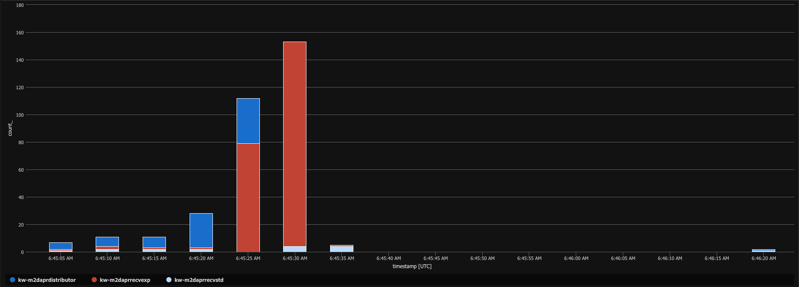
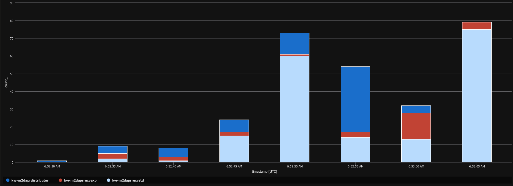
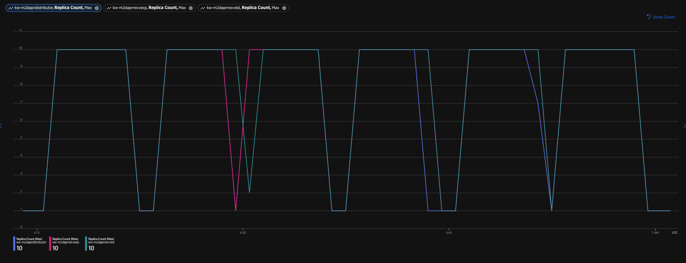
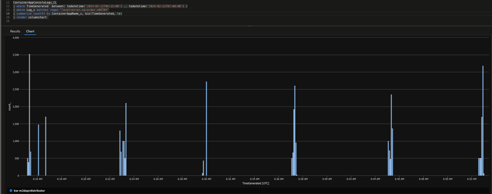
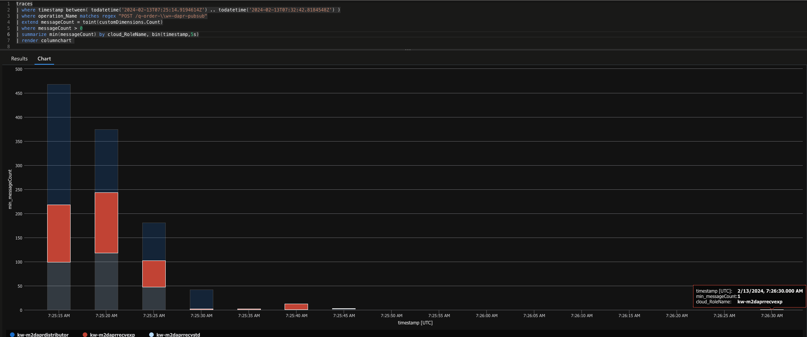

## TL;DR

In this post I show

- how to convert a .NET C# program processing messages from Azure Service Bus with **Dapr input bindings** to **Dapr bulk pubsub**
- how to activate and remove Dapr components even with an incremental **ARM/Bicep** deployment
- how to use Dapr multi run for testing locally
- what to consider and where to measure to achieve desired throughput goals

## Motivation

> real motivation: In my day job as an architect I am often too far away from coding artifacts that really go into production (and would deliver value and sustain there). Folks just keep me away from production code for a good reason : my prime days for such kind of work are over, as practices evolved too far for me to keep up with just coding from time to time.
> However, to unwind, I grant myself the occassional excursion, try out and combine stuff that is hard to do in product or project context's with ambitioned deadlines and value-delivery expectations.

This post builds up or is a sequel to my previous [post on comparing Azure Functions vs Dapr throughput on Azure Container Apps](https://dev.to/kaiwalter/comparing-azure-functions-vs-dapr-on-azure-container-apps-2noh). I detected back then, that processing a given workload of 10k messages with an ASP.NET application backed with Dapr seems to perform faster than doing that with a Functions container or the Functions on ACA footprint.

Some of the underpinnings of that offering are going to get improved, on which I will make a post when released. These changes however already show a significant improvement in processing of the Functions stacks, with now the Dapr variant falling behind:

| timestamp                     | stack                               | cycle time in seconds |
| ----------------------------- | ----------------------------------- | --------------------: |
| 2024-02-05T17:09:54           | FUNC                                |                    30 |
| 2024-02-05T17:19:17           | ACAF                                |                    36 |
| 2024-02-05T17:28:49           | DAPR                                |                    46 |
| 2024-02-05T17:38:35           | FUNC                                |                    32 |
| 2024-02-06T05:50:08           | ACAF                                |                    47 |
| 2024-02-06T06:11:08           | DAPR                                |                    53 |
| 2024-02-06T06:32:11           | FUNC                                |                    31 |
| 2024-02-06T06:52:40           | ACAF                                |                    34 |
| 2024-02-06T07:15:33           | DAPR                                |                    46 |
| 2024-02-06T07:37:28           | FUNC                                |                    38 |
| 2024-02-08T13:38:10           | ACAF                                |                    50 |
| 2024-02-08T13:45:23           | DAPR                                |                    63 |
| 2024-02-08T13:52:40           | FUNC                                |                    36 |
| 2024-02-08T13:59:45           | ACAF                                |                    37 |
| 2024-02-08T14:06:37           | DAPR                                |                    43 |
| 2024-02-08T14:13:58           | FUNC                                |                    35 |
| 2024-02-08T14:21:01           | ACAF                                |                    36 |
| 2024-02-08T14:27:43           | DAPR                                |                    47 |
| 2024-02-08T14:35:01           | FUNC                                |                    37 |
| 2024-02-08T14:42:00           | ACAF                                |                    38 |
| 2024-02-08T14:48:43           | DAPR                                |                    46 |
|                               |                                     |                       |
| average / standard deviation: | ACAF = Functions on ACA             |            39.7 / 6.2 |
|                               | DAPR = Dapr in Container on ACA     |            49.1 / 6.8 |
|                               | FUNC = Function in Container on ACA |            34.1 / 3.1 |

> 1. measured with Azure Container Apps Consumption workload profile, not a dedicated workload profile!
> 2. to achieve a more realistic measurement, different to the original post, not the timestamps (in telemetry, Application Insights) between the first and last request processed are measured but the time from when the 10k messages are scheduled until all messages have been stored into blobs

Back then I did not max out the capabilities of Dapr's message processing capabilities, as the point we had to prove internally - "What is faster: Dapr or Functions?" - already showed the desired results. Also the Dapr implementation with Azure Service Bus **Dapr input bindings** reflected the majority of our implementations.

This post is about what I did, to squeeze more performance out of the Dapr implementation. The goal would be also have a cycle time of 30-35 seconds for the Dapr implementation.

## Basic Assumption

In the Dapr implementation so far, for each of the 10k messages an input binding endpoint is frantically hit by the Dapr sidecar which has the application to invoke respective output binding endpoints in the same frequency:

```csharp
app.MapPost($"/q-order-ingress-{testCase}-input", async (
    [FromBody] Order order,
    [FromServices] DaprClient daprClient
    ) =>
{
    switch (order.Delivery)
    {
        case Delivery.Express:
            await daprClient.InvokeBindingAsync($"q-order-express-{testCase}-output", "create", order);
            break;
        case Delivery.Standard:
            await daprClient.InvokeBindingAsync($"q-order-standard-{testCase}-output", "create", order);
            break;
    }

    return Results.Ok(order);
});
```

While exploring other hosting and compute options like [Dapr, WebAssembly and Spin](https://github.com/ZEISS/enterprise-wasm/tree/main/samples/spin-dapr-rs) I realized, that this kind of implementation causes a lot of traffic in the Dapr to application communication which can easily stand in the way of faster compute processing.

Dapr still has an option available (currently in **alpha** status) to reduce this kind of noice by reducing amount of invocations exchanged between Dapr and the App : [Publish and subscribe to bulk messages](https://docs.dapr.io/developing-applications/building-blocks/pubsub/pubsub-bulk/).

## Conversion

> all code snippets shown hereinafter, can be followed along and found in [dapr-pubsub branch of the repository I already used in the previous post](https://github.com/KaiWalter/message-distribution/tree/dapr-pubsub)

### Convert To Single PubSub

I try to take small steps forward when converting or transforming implementations - just to to be able keep track on cause and effect.

Conversion required in .NET code to get from input bindings to pubsub are minor. I still keep Azure Service Bus queues as messaging resource and will not switch to topics. This is a preference on my end as I prefer the dedicated dead letter handling of queues on single edges on a given messaging path than over dead letter handling with topics.

When using Azure Service Bus queues with Dapr pubsub, `order-pubsub` in `PublishEventAsync` below refers to a single Dapr component in ACA (Azure Container Apps environment) - compared to indvidual components required for input and output bindings - while `q-order-...` determines that queue itself.

Also at his point I do not burden my self with a conversion to **CloudEvents** and keep message processing "raw" : `{ "rawPayload", "true"}` when publishing and avoiding `app.UseCloudEvents();` on application startup. I noticed that, when combining bulk pubsub with CloudEvents, the message payload is suddenly rendered in JSON **camelCase** (!) instead of the expected **PascalCase** and that is definetely a worry for another day.

```csharp
app.MapPost($"/q-order-ingress-{testCase}-pubsub-single", async (
    [FromBody] Order order,
    [FromServices] DaprClient daprClient
    ) =>
{
    var metadata = new Dictionary<string, string>
        {
          { "rawPayload", "true"}
        };

    switch (order.Delivery)
    {
        case Delivery.Express:
            await daprClient.PublishEventAsync("order-pubsub", $"q-order-express-{testCase}", order, metadata);
            break;
        case Delivery.Standard:
            await daprClient.PublishEventAsync("order-pubsub", $"q-order-standard-{testCase}", order, metadata);
            break;
    }

    return Results.Ok(order);
});
```

As I want to manage pubsub subscriptions programmatically, an endpoint to configure these subscriptions is required:

```csharp
app.MapGet("/dapr/subscribe", () => Results.Ok(new[]{
new {
    pubsubname = "order-pubsub",
    topic = $"q-order-ingress-{testCase}",
    route = $"/q-order-ingress-{testCase}-pubsub-single"
}}));
```

> this is the `daprdistributor` implementation; `daprreceiver` implementation is adapted accordingly receiving messages from pubsub instead from input binding

### Dapr Component Switching

To be able to switch the environment between both bindings and pubsub, as the general flow is controlled by Dapr components not by the application, I need to have a **Bicep** parameter like ...

```bicep
@description('determines whether bindings or pubsub is deployed for the experiment')
@allowed([
  'bindings'
  'pubsub'
])
param daprComponentsModel string
```

... which then controls relevance of Dapr components through scoping for the individual applications:

```bicep
// switch valid application ids for the respective deployment model
var scopesBindings = daprComponentsModel == 'bindings' ? {
  distributor: 'daprdistributor'
  recvexp: 'daprrecvexp'
  recvstd: 'daprrecvstd'
} : {
  distributor: 'skip'
  recvexp: 'skip'
  recvstd: 'skip'
}

var scopesPubSub = daprComponentsModel == 'pubsub' ? [
  'daprdistributor'
  'daprrecvexp'
  'daprrecvstd'
] : [
  'skip'
]
```

These scopes are then linked to Dapr components relevant for the desired model.

```bicep
  resource pubSubComponent 'daprComponents' = {
    name: 'order-pubsub'
    properties: {
      componentType: 'pubsub.azure.servicebus.queues'
      version: 'v1'
      secrets: [
        {
          name: 'sb-root-connectionstring'
          value: '${listKeys('${sb.id}/AuthorizationRules/RootManageSharedAccessKey', sb.apiVersion).primaryConnectionString};EntityPath=orders'
        }
      ]
      metadata: [
        {
          name: 'connectionString'
          secretRef: 'sb-root-connectionstring'
        }
        {
          name: 'maxActiveMessages'
          value: '1000'
        }
        {
          name: 'maxConcurrentHandlers'
          value: '8'
        }
      ]
      scopes: scopesPubSub
    }
  }
```

Although this way of handling switching Dapr components in a **ARM/Bicep incremental deployment context** is not production grade and requires a post-deployment step like ...

```
az containerapp env dapr-component list -g $RESOURCE_GROUP_NAME -n $ACAENV_NAME \
  --query "[?properties.scopes[0]=='skip'].name" -o tsv | \
  xargs -n1 az containerapp env dapr-component remove -g $RESOURCE_GROUP_NAME -n $ACAENV_NAME --dapr-component-name
```

... to clean up non-used components, it is OK-ish for such an evaluation environment at the moment.

In the end I then just need to modify the `.env` file in the repositories root, to switch the desired model:

```env
AZURE_LOCATION=eastus
AZURE_ENV_NAME=my-env
DAPR_COMPONENTS_MODEL=bindings
DAPR_PUBSUB_MODEL=single
```

### Local Testing

With all those small changes and re-tests ahead I invested some more time in local testability of the whole environment. For that I created a [Dapr Multi-App Run](https://docs.dapr.io/developing-applications/local-development/multi-app-dapr-run/multi-app-overview/) file which allows to run all applications in concert:

```yaml
version: 1
apps:
  - appID: distributor
    appDirPath: ./src/daprdistributor/
    resourcesPath: ./components-pubsub
    configFilePath: ./components-pubsub/config.yaml
    appProtocol: http
    appPort: 3001
    daprHTTPPort: 3501
    appHealthCheckPath: "/health"
    placementHostAddress: ""
    logLevel: "debug"
    command: ["dotnet", "run"]
    env:
      ASPNETCORE_URLS: http://localhost:3001
      ASPNETCORE_ENVIRONMENT: Development
      TESTCASE: dapr
  - appID: receiver-express
    appDirPath: ./src/daprreceiver/
    resourcesPath: ./components-pubsub-express
    configFilePath: ./components-pubsub-express/config.yaml
    appProtocol: http
    appPort: 3002
    daprHTTPPort: 3502
    appHealthCheckPath: "/health"
    placementHostAddress: ""
    logLevel: "debug"
    command: ["dotnet", "run"]
    env:
      ASPNETCORE_URLS: http://localhost:3002
      ASPNETCORE_ENVIRONMENT: Development
      TESTCASE: dapr
      INSTANCE: express
  - appID: receiver-standard
    appDirPath: ./src/daprreceiver/
    resourcesPath: ./components-pubsub-standard
    configFilePath: ./components-pubsub-standard/config.yaml
    appProtocol: http
    appPort: 3003
    daprHTTPPort: 3503
    appHealthCheckPath: "/health"
    placementHostAddress: ""
    logLevel: "debug"
    command: ["dotnet", "run"]
    env:
      ASPNETCORE_URLS: http://localhost:3003
      ASPNETCORE_ENVIRONMENT: Development
      TESTCASE: dapr
      INSTANCE: standard
```

Accompanied by a small script to publish both types of messages into the local environment and observe the flow:

```shell
#!/bin/bash

set -e

ORDERID=0

function generate_message()
{
  UUID=`uuidgen`
  if [[ $((ORDERID % 2)) -eq 0 ]]; then
    DELIVERY=Express
  else
    DELIVERY=Standard
  fi
  jq -c -n \
        --arg uuid "$UUID" \
        --arg orderid "$ORDERID" \
        --arg delivery "$DELIVERY" \
        '{OrderId: $orderid|tonumber, OrderGuid: $uuid, Delivery: $delivery}'
}

ORDERID=$((ORDERID + 1))
dapr publish --publish-app-id distributor \
  --topic q-order-ingress-dapr \
  --pubsub order-pubsub \
  --data "$(generate_message)" \
  --metadata '{"rawPayload":"true"}'

ORDERID=$((ORDERID + 1))
dapr publish --publish-app-id distributor \
  --topic q-order-ingress-dapr \
  --pubsub order-pubsub \
  --data "$(generate_message)" \
  --metadata '{"rawPayload":"true"}'
```

### First Pit Stop

It seems using **pubsub** puts a toll on the performance.

| implementation                         | average, 5 cycles | standard deviation |
| -------------------------------------- | ----------------: | -----------------: |
| Dapr input bindings, before conversion |             48.6s |               6.2s |
| Dapr single pubsub                     |            103.4s |               7.5s |

## The Valley Of Tears

I thought, with just implementing bulk pubsub performance will increase dramatically. I reduce single message transfers to block transfers and it seems logical, that just by that messages are bursted through the environment at light speed. Well, ...

### Converting To Bulk PubSub

To apply bulk pubsub on subscription programmatically, just meta information needs to be enhanced:

```csharp
app.MapGet("/dapr/subscribe", () => Results.Ok(new[]{
new {
    pubsubname = "order-pubsub",
    topic = $"q-order-ingress-{testCase}",
    route = $"/q-order-ingress-{testCase}-pubsub",
    bulkSubscribe = new {
      enabled = true,
      maxMessagesCount = 100,
      maxAwaitDurationMs = 40,
    }
}}));
```

On the processing endpoint changes are more substantial:

- messages are passed in a bulk, hence looping is required to process single messages
- response collections need to be maintained to tell Dapr, which of the incoming entries/messages processed successful, which need to be retried or dropped
- messages to be published in a bulk also need to be collected for sending outbound
- again, let no **CloudEvents** slip in at that moment

```csharp
app.MapPost($"/q-order-ingress-{testCase}-pubsub", async (
    [FromBody] BulkSubscribeMessage<Order> bulkOrders,
    [FromServices] DaprClient daprClient,
    ILogger<Program> log
    ) =>
{
    log.LogInformation("{Count} Orders to distribute", bulkOrders.Entries.Count);
    List<BulkSubscribeAppResponseEntry> responseEntries = new List<BulkSubscribeAppResponseEntry>(bulkOrders.Entries.Count);
    var expressEntries = new List<BulkSubscribeMessageEntry<Order>>(bulkOrders.Entries.Count);
    var standardEntries = new List<BulkSubscribeMessageEntry<Order>>(bulkOrders.Entries.Count);

    foreach (var entry in bulkOrders.Entries)
    {
        var order = entry.Event;

        switch (order.Delivery)
        {
            case Delivery.Express:
                expressEntries.Add(entry);
                break;
            case Delivery.Standard:
                standardEntries.Add(entry);
                break;
        }
    }

    var metadata = new Dictionary<string, string>
        {
          { "rawPayload", "true"}
        };

    if (expressEntries.Count > 0)
    {
        try
        {
            var orders = from e in expressEntries select e.Event;
            await daprClient.BulkPublishEventAsync("order-pubsub", $"q-order-express-{testCase}", orders.ToArray(), metadata);
            foreach (var entry in expressEntries)
            {
                responseEntries.Add(new BulkSubscribeAppResponseEntry(entry.EntryId, BulkSubscribeAppResponseStatus.SUCCESS));
            }
        }
        catch (Exception e)
        {
            log.LogError(e.Message);
            foreach (var entry in expressEntries)
            {
                responseEntries.Add(new BulkSubscribeAppResponseEntry(entry.EntryId, BulkSubscribeAppResponseStatus.RETRY));
            }
        }
    }

    if (standardEntries.Count > 0)
    {
        try
        {
            var orders = from e in standardEntries select e.Event;
            await daprClient.BulkPublishEventAsync("order-pubsub", $"q-order-standard-{testCase}", orders.ToArray(), metadata);
            foreach (var entry in standardEntries)
            {
                responseEntries.Add(new BulkSubscribeAppResponseEntry(entry.EntryId, BulkSubscribeAppResponseStatus.SUCCESS));
            }
        }
        catch (Exception e)
        {
            log.LogError(e.Message);
            foreach (var entry in standardEntries)
            {
                responseEntries.Add(new BulkSubscribeAppResponseEntry(entry.EntryId, BulkSubscribeAppResponseStatus.RETRY));
            }
        }
    }


    return new BulkSubscribeAppResponse(responseEntries);
});
```

> this is the `daprdistributor` implementation; `daprreceiver` implementation is adapted accordingly receiving bulk messages but storing to blob with single requests

### Second Pit Stop

Even with having 2 cycles faster then 40s, still there are outliers which take 60-70s. Which in turn results in this average:

| implementation      | maxMessagesCount | average, 5 cycles | standard deviation |
| ------------------- | ---------------: | ----------------: | -----------------: |
| Dapr input bindings |             n.a. |             48.6s |               6.2s |
| Dapr single pubsub  |             n.a. |            103.4s |               7.5s |
| Dapr bulk pubsub    |              100 |             57.6s |              19.2s |

### Crank It Up

A `maxMessagesCount` of **100** does not seem to make a dent. Let's increase:

```
      maxMessagesCount = 500,
```

Although having half of the requests with a significant better cycle time, the other half still took twice the time (standard deviation ~21s on a 64s average):

| timestamp           | cycle time |
| ------------------- | ---------: |
| 2024-02-12T06:15:09 |         36 |
| 2024-02-12T06:22:50 |         43 |
| 2024-02-12T06:29:41 |         80 |
| 2024-02-12T06:37:04 |         81 |
| 2024-02-12T06:45:04 |         78 |
| 2024-02-12T06:52:34 |         38 |

Using a query like ...

```
requests
| where timestamp between( todatetime('2024-02-12T06:45:04.7285069Z') .. todatetime('2024-02-12T06:52:34.2132486Z') )
| where name startswith "POST" and cloud_RoleName matches regex "^[\\d\\w\\-]+dapr"
| where success == true
| summarize count() by cloud_RoleName, bin(timestamp, 5s)
| render columnchart
```

... shows a processing gap towards the end of processing ...



... while in this sample processing is in one block without a gap:



Looking at the replica count for all 3 services during the testing period shows, that those go consitently up to 10 and down again. Also no replica restarts are reported. Hence non-availibilty of replicas can be ruled out for causing these gaps.



Additionally I found many **RETRY** errors captured for during bulk subscribe processing, ...

```
time="2024-02-12T06:30:00.08158319A3Z" level=error msg="App handler returned an error for message 5888d18e-da39-44b4-81d9-a2e11bef21bb on queue q-order-ingress-dapr: RETRY required while processing bulk subscribe event for entry id: 27180f25-502b-4d13-a738-77306a6d3f01"
```

... spread out over all test cycles but only logged for **Distributor** service.



Looking for the root cause of these retries I found ...

```
dependencies
| where timestamp between( todatetime('2024-02-12T06:15:00') .. todatetime('2024-02-12T07:00:00') )
| where cloud_RoleName endswith "daprdistributor"
| where name == "/dapr.proto.runtime.v1.dapr/bulkpublisheventalpha1"
| order by timestamp asc
```

```
error when publish to topic q-order-express-dapr in pubsub order-pubsub: the message is too large
```

... which means, that a maxMessagesCount of 500 can cause **Distributor** to generate too large bulk publish packets.

OK, so let's increase carefully ...

```
      maxMessagesCount = 250,
```

... and then check for errors again.

```
dependencies
| where customDimensions.error != ""
| order by timestamp desc
```

### Third Pit Stop

Not quite, but close.

| implementation      | maxMessagesCount | average, 5 cycles | standard deviation |
| ------------------- | ---------------: | ----------------: | -----------------: |
| Dapr input bindings |             n.a. |             48.6s |               6.2s |
| Dapr single pubsub  |             n.a. |            103.4s |               7.5s |
| Dapr bulk pubsub    |              100 |             57.6s |              19.2s |
| Dapr bulk pubsub    |              250 |             42.8s |              13.1s |

Still for the slow test cycles there is a gap until all records are processed:



> Exactly for these kind of measurements I log the bulk messsage count with `log.LogInformation("{Count} Orders to distribute", bulkOrders.Entries.Count);` to have an indication on how many messages are handed over in one bulk.

At this point I even tried to switch to a dedicated workload profile type - instead of consumption - to rule out that "noisy neighbors" are causing the processing to lag. But no, same effects also with dedicated this processing gap occured.

> Side node: I had to go up to **E8** workload profile type to get to a processing speed similar to consumption model.

### Beware Of Message Locks

Fine. Back to telemetry. Checking what else is logged on the containers ...

```
ContainerAppConsoleLogs_CL
| where TimeGenerated between( todatetime('2024-02-13T16:07:05.8171428Z') .. todatetime('2024-02-13T16:45:47.5552143Z') )
| where ContainerAppName_s contains "daprdist"
| where Log_s !contains "level=info"
| order by TimeGenerated asc
```

... reveals that almost exactly at the point before final processing continues, this type of error is logged:

```
...
time="2024-02-13T16:14:05.778260655Z" level=warning msg="Error renewing message locks for queue q-order-ingress-dapr (failed: 43/758):
couldn't renew active message lock for message ff3d2095-effb-428e-87bf-e131c961ac4e: lock has been lost
...
```

Looking at the `order-pubsub` component in the `containerapps.bicep` I realized I missed a spot. Measuring earlier how many bulks could be processed at full size (e.g. 100) I observed, that very soon during the processing cycle, the Dapr Service Bus implementation was creating smaller bulks (even with size 1) as 8 `maxConcurrentHandlers`, after waiting `maxAwaitDurationMs = 40` (see pubsub subscribe above), were just pulling "what they get". Hence I tuned down `maxConcurrentHandlers` to 1 to avoid that kind of congestion.

```bicep
resource pubSubComponent 'daprComponents' = {
    name: 'order-pubsub'
    properties: {
      componentType: 'pubsub.azure.servicebus.queues'
      version: 'v1'
      secrets: [
        {
          name: 'sb-root-connectionstring'
          value: '${listKeys('${sb.id}/AuthorizationRules/RootManageSharedAccessKey', sb.apiVersion).primaryConnectionString};EntityPath=orders'
        }
      ]
      metadata: [
        {
          name: 'connectionString'
          secretRef: 'sb-root-connectionstring'
        }
        {
          name: 'maxActiveMessages'
          value: '1000'
        }
        {
          name: 'maxConcurrentHandlers'
          value: '1'
        }
      ]
      scopes: scopesPubSub
    }
  }
}
```

However I did not pay attention to `maxActiveMessages` - which before were divided by 8 handlers, what in turn allowed Dapr sidecar and the app to process a block of 125 locked message in time (before the lock expires). Now 1 handler was locking all 1000 messages and even with bulk processing some message locks could expire.

Consequently I think it makes more sense to tune the amount of active messages pulled at a time to the potential bulk size:

```bicep
        {
          name: 'maxActiveMessages'
          value: '250'
        }
```

### The Last Mile

Changing this setting did not make the warning completely go away. As Alessandro Segala states in this [issue](https://github.com/dapr/components-contrib/issues/2532) : _"This happens because when it's time to renew the locks, at the interval, we "snapshot" the active messages and then renew each one's lock in sequence. If you have a high number for maxActiveMessages, it takes time for the component to renew the locks for each one, and if the app has ACK'd the message in the meanwhile, then the lock renewal fails."_

However as results show: the better noise and congestion is reduced in the environment, the better and more reliable the throughput.

| implementation      | maxMessagesCount | maxActiveMessages | maxConcurrentHandlers | average, 5 cycles | standard deviation |
| ------------------- | ---------------: | ----------------: | --------------------: | ----------------: | -----------------: |
| Dapr input bindings |             n.a. |              1000 |                     8 |             48.6s |               6.2s |
| Dapr single pubsub  |             n.a. |              1000 |                     8 |            103.4s |               7.5s |
| Dapr bulk pubsub    |              100 |              1000 |                     1 |             57.6s |              19.2s |
| Dapr bulk pubsub    |              250 |              1000 |                     1 |             42.8s |              13.1s |
| Dapr bulk pubsub    |              250 |               250 |                     1 |             28.0s |               3.6s |

> Disclaimer: This combination of configuration values is just tuned for this particular scenario. With this post I just want to show, what to consider, what to look out for and where to calibrate.

## Conclusion

Running all 3 stacks on the same environment now shows, that an invest in bulk pubsub definitely pays out.

| stack                               | average, 6 cycles | standard deviation |
| ----------------------------------- | ----------------: | -----------------: |
| ACAF = Functions on ACA             |             36.0s |               3.5s |
| DAPR = Dapr in Container on ACA     |             27.8s |               1.6s |
| FUNC = Function in Container on ACA |             34.0s |               2.4s |

As always there is no free lunch and some points have to be considered:

- [Dapr HTTP and gRPC payload size](https://docs.dapr.io/operations/configuration/increase-request-size/)
- just switching to bulk pubsub is not enough; the additional aggregation and collection times (see `maxAwaitDurationMs`) need to be outweighed by the gains achieved with packaging data
- with larger payloads moving through an environment, impact on all involved components needs to be considered and then balanced for optimum outcome

When I set out writing this post I already observed some of these lags shown above, not sure whether I would be able to identify and overcome those. But hey, that are exactly the challenges I seek.
