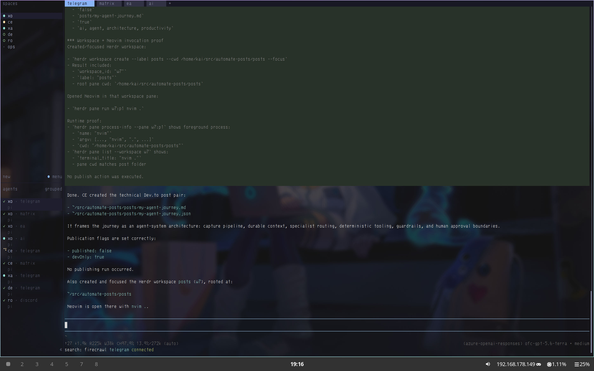
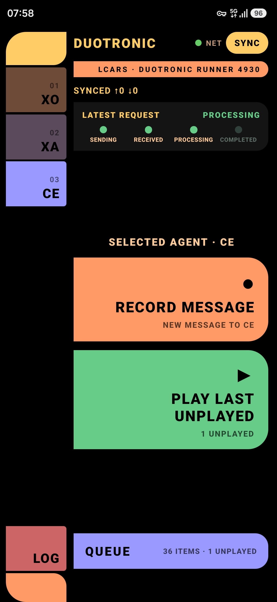

## Motivation

After months of prompting and observing, evaluating how or whether pieces were falling into place - or not - I had the urge to just **write**. Old school: in Neovim, backed by my seasoned "posting harness", Spotify on some Deep House track --- my posting zen mode.

8 months ago I posted the last time in this forum on a [n8n based agentic flow](https://dev.to/kaiwalter/challenging-n8n-ai-agent-with-a-personal-productivity-flow-2a17). Actually exactly on year ago I posted on using [Dapr Agents for my "agentic" scenario](https://dev.to/kaiwalter/dipping-into-dapr-agentic-workflows-fbi). Up to that point I had to produce technical artifacts on my own, of course from 2022 on with AI coding assistance. Then February the OpenClaw wave also hit me. It consumed all my energy I usually spent on exploring various software engineering topics. The speed in which capabilities unfolded for me seemed to have left no bandwidth for me to stop, breathe and exhale.

Here we are.

## February to April : OpenClaw

With Dapr Agents and then n8n I was able to achieve my basic requirement:

> I am out, mostly in the mornings for a walk or run, and I just want to drop a thought or a task immediately. Sometimes even complete sections of an upcoming presentation. Or rushing between meeting, the same: Just drop a voice recording and have it turned into a task or just as a note into my email inbox.

Still a bit clunky as I had to rely on _Easy Voice Recorder Pro_ and _Microsoft OneDrive_ in combination to handle the recording and transfer into the inbox of those agents. The experience had been OK-ish, still made me think twice before really recording something as I often had to jump start infrastructure when returning to the console.

Hooking up _OpenClaw_ to a _Telegram_ bot instantly brought me the desired boost: control an entity with voice from my phone wherever I am, even getting responses as voice messages so I could listen to whatever I was elaborating on.

I did not need all the fancy stuff people were exploring with _OpenClaw_ or later _Hermes_ - like computer control. Hence I tuned down _OpenClaw_ to "just" being able to ...

- log (voice) notes to a set of agent curated project and framework documents
- capture relevant quotes or whole sections from social media content (video & audio)
- synthesize on those documents - with or without mixing in searchable content from the internet
- transfer synthesized or original content to my office environment for further processing at my desk
- create tasks or reminders in my office environment
- give me details on my calendar - office and private

With that the first time I got a **perceivable value from AI**: the capability to unload from and load myself with relevant content, almost like a _Harry Potter Pensieve_. 

Some of the learnings and key success factors (for me) in that phase:

### YOLO - not for me

What made the _OpenClaw_ experience superior to previous agentic approaches? I was able to add capabilities to the environment on the fly - with natural language, voice!

I did not lean into YOLO hype, kept the environment within the boundaries I felt necessary. I was carefully listening what was going on in the space, was integrating what seemed to offer value and discarding quickly what did not stick.

To play safe I started running _OpenClaw_ in a _docker_ instance, added and tunneled through a _squid_ proxy in a paired network isolated container with `docker-compose` to have control of the outbound connections of the agent. I stuck to that approach for the first 3-4 weeks to gain confidence on how to shape system prompts (and there are many in _OpenClaw_) and skills + tools in a way, so that the agent truly stays on the path I needed to have for my agent.

After that period I brought the set of agents into a set of `systemd` controlled services. Those services I operated in a restricted `openclaw` user context to avoid out-of-bounds system manipulation.

### NixOS and coding agents - a match made in heaven

Having a [declarative operating system environment](https://nixos.org/) available for the agent almost seemed like a natural choice: any OS capability and auxiliary binary the system was lacking could be resolved and transparently added by the agent. However I did not handover the reins immediately. I had _OpenClaw_ on a dedicated system with a dedicated limited user. Within that user the agent was able to adapt the system configuration in a designated worktree and switch into it on my explicit request (elevation/approval). At anytime I was able to pull the plug, revert to a previous configuration and only PR stable system configurations into the main worktree.

Over time I was also moving the startup configuration of _OpenClaw_ into the _NixOS_ configuration. Separating data and control plane helped achieving clean rollbacks after disastrous experiments.

### Multi-modal messaging

Voice in and voice out. For me the essence when preparing or strategizing or just unloading. Additionally I got used to taking pictures from flipcharts or whiteboards with _Telegram_ and handing of to the agent for meeting notes or concept documents. Both media processing capabilities helped reducing mental load - not needing to think about that I still need to process a note or an image. Often I accompanied such a media capture with creating a to do item I most certainly would not miss. Or having the content transferred to my inbox so I could turn it into a proper email.

> In the _OpenClaw_ setup I relied on `gogcli` and _Google Mail_, however switched to [AgentMail](https://www.agentmail.to/) with _Pi Agent_ for a more agent-like experience.

### A note on memory

When starting with _OpenClaw_ I operated various available patterns and extensions to deal with memory and keep the agents learning (from positive and negative "experiences"). That worked for me to some degree to synthesize learnings from sessions over daily memory to **lessons learned**. Those where the times of _QMD_, which is now replaced with internal memory.

However, I struggled with getting the agents to "the rights things" to learn. After a while I dropped built-in memory patterns and relied more on explicitly forming my intent and desired behaviors into agent instructions `AGENTS.md`, `SOUL.md`, `USER.md` and `MEMORY.md` (from that file resolving into concepts, projects, frameworks, glossary and other types of purpose-bound memory),  as well as explicit skills for the major operations. Additions to those purpose-bound memory files were only made on my explicit request.

### Taming The Beast(s)

Over time it turned out that _OpenClaw_ (I also evaluated _Hermes_ for that) is too heavy for my rather closed use case, which by then I narrowed down to

1. A Second Brain
2. An Executive Assistant
3. A Coding Agent for on-the-spot / disposable Software

Which led me to ...

## May to now : Pi Agent

I loved the minimalistic approach of [Pi](https://pi.dev/) immediately, once I stumbled over it. I started with one default agent, connected to _Telegram_ and had the same basic experience as with _OpenClaw_. This thing by default is crazier than its downstream peer: when I was sending in a voice message (indeed as message #3), it was detecting that it lacked the capability to process audio messages and went off bringing this capability to life.

> I let the agent extract all audio capabilities in this [fork of the generally available pi-telegram extension](https://github.com/KaiWalter/pi-telegram-with-audio)

### Engineering Agents and Officer Agents

_Pi_ primarily is a coding agent, highly suitable for software engineering tasks. For other agent types, `SYSTEM.md` can be used to strip away the engineering genes and make the agent whatever the primary purpose should be. I call this class of agents "Officer Agents". In my environment I currently have the know-it-all **Chief of Staff** and still the time-and-task-management-purposed **Executive Assistant**. Engineering class agents on the other hand are extended with `APPEND_SYSTEM.md` for any target environment specifics I need the agents to understand.

As _OpenClaw_ also _Pi Agent_ understands `SKILL.md` skill files and scripts. For my observation the 2 system prompt artifacts can be kept very small which makes it rather efficient and tuned for the job.

Over time this allowed me to really fine tune those agents and in regular operation use small models like `gpt-5.6-luna` or `gpt-5.3-codex`, only bumping up to heavier models for more complex tasks. 

### Personalities / Agent Roles

With _OpenClaw_ I leaned into the concept of `SOUL.md` and enjoyed the flippant and playful comments in the responses for a while. Crossing over to _Pi Agent_ I dropped most of it and worked with these agent roles and characters:

| code | name (OpenClaw soul) | role | capabilities |
| ---- | ---- | ---- | ---- |
| XO | R2-D2 | Executive Officer / Chief of Staff | second brain / knowledge base, planning and orchestrating multi-agent goal-based work, has sub agent for research |
| XA | C-3PO | Executive Assistant | managing calendar and tasks |
| CE | Chewie | Chief Engineer | managing host and agent environment, on-the-spot software generation, has sub agents for research, repository scouting, cloud and experimental engineering |
| DE | BB-8 | Diagnostic Engineer | problem debugging and error reporting, fallback engineer |
| RO | Robbie | Family Assistant | manages family calendar, waste pick up schedule, shopping list (is connected over Discord) |

### Terminal Multiplexer

While I was running _OpenClaw_ as daemon service on a headless machine (now with more experience and confidence under the belt) I wanted _Pi Agent_ to operate on a full Linux desktop (NixOS of course!). Additionally I wanted to be able to observe and intervene in agent operations on the desktop instantly. Being a seasoned _tmux_ I let my agent configure its own startup into that environment. That was working OK.

As demand for more precise agentic terminal control grew, I migrated to [herdr](https://herdr.dev/). 

Although my agents bounce regular tasks at each other using [Dapr pub/sub](https://docs.dapr.io/developing-applications/building-blocks/pubsub/pubsub-overview/) from time to time it is required for one agent (especially my Diagnostic Engineer) to take hard control over another agent's pane. Here _Herdr_ offers a clean CLI and makes those type of operations more reliable than just "terminal keypressing".

### Memory

On _Pi_ I moved from the loosely structured arrangement of `.md` files to [Open Knowledge](https://openknowledge.ai/) which provides

1. a CLI for the agents to operate with the knowledge base
2. a WebUI for me to work with the knowledge base without causing conflicts with the agent's contributions

I established some rules on how to treat various types of content. Raw or original content provided by me would only be added on my explicit request and is marked as such - not to be overwritten by any of the agents' processes. Content synthesized from original content or from the web does not have that level of protection. Here agents (mainly Chief of Staff in a Second Brain capacity) would update based on further synthesis or new insights. From time to time on certain concepts or projects I let the agent clean out the synthesized information and restart that process.

### Messaging

Since spring I was mainly relying on _Telegram_ for message in- and outbound to and from my agents. I kept the bot channels with a 1d deletion window, so that my agent messages would not be kept on the platform for eternity. Considering the growing sensitivity of information I want to process with my agents in the future, I decided to move to a self-hosted and secured [Matrix](https://matrix.org/) infrastructure with a modified _Element X_ build on my phone and a [Matrix to Pi bridge](https://github.com/KaiWalter/pi-matrix-transport). Again the coding agent helps here to tailor and secure the stack to my needs - an effort I would not been able to move into just a few months back.

### Geeking Out

Using _Telegram_ or _Matrix_ is fine when stationary. Especially when being on the go I wanted to have a simpler voice-only interface with a Record and a Play button. I love these times. I just connected the phone with USB, followed the instructions provided by the coding agent to enable USB deployment and let the coding agent do its magic:

