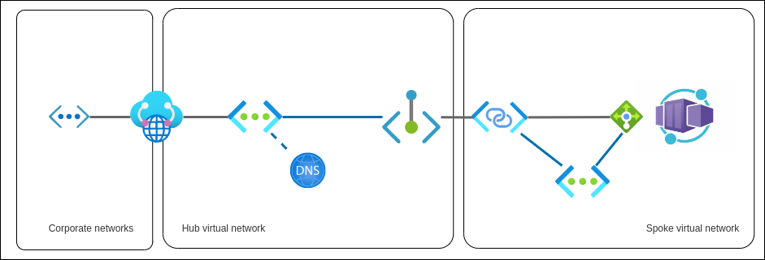

> This post is an updated version of [my Feb'22 post "Private linking an Azure Container App Environment"](https://dev.to/kaiwalter/preliminary-private-linking-an-azure-container-app-environment-3cnf), uses Bicep instead of Azure CLI to deploy Private Linking configuration but is reduced to the pure configuration without jump VM and sample applications.
>  **+plus** it applies **Bicep CIDR functions** to calculate sample network address prefixes

## Motivation

When originally posting in spring 2022 our challenge was, that we would not be granted multiple large enough (/21 CIDR range, 2048 IP addresses) address spaces within our corporate cloud address spaces - as being one of many, many workloads in the cloud - which could hold the various Container Apps environments - while still being connected to corporate resources. Now that this limitation is more relaxed [- /23, 512 IP addresses for consumption only and /27, 32 IP addresses for workload profile environments - ](https://learn.microsoft.com/en-us/azure/container-apps/networking#subnet) we could rework our configuration. However over time we learned to appreciate some of the other advantages this separation delivered:

- clear isolation of container workloads with a high degree of control what types of traffic go in (this post) and out [(see also posts on Private Linking back from Container Apps to API Management](https://dev.to/kaiwalter/use-azure-application-gateway-private-link-configuration-for-an-internal-api-management-1d6o) or [port forwarding)](https://dev.to/kaiwalter/private-linking-and-port-forwarding-to-non-azure-resources-5h0f) the compute environment
- having enough breathing space in terms of IP addresses so to almost never hit any limitations (e.g. in burst scaling scenarios)
- being able to stand up additional environments at any time as the number of IP addresses required in corporate address space is minimal

## Solution Elements

To simplify terms for this post I assume the corporate network connected virtual network with limited address space would be the **hub network** and the virtual network containing the **Container Apps Environment** (with the /21 address space) would be the **spoke network**.****

This is the suggested configuration:

- a **private link service** within **spoke network** linked to the `kubernetes-internal` Load balancer
- a **private endpoint** in the **hub network** linked to  **private link service** above
- a **private DNS zone** with the Container Apps domain name and a `*` `A` record pointing to the **private endpoint**'s IP address

> DISCLAIMER: the approach in this article is based on the **assumption**, that the underlying AKS node resource group is visible, exposed and the name matches the environments domain name (in my sample configuration domain was `redrock-70deffe0.westeurope.azurecontainerapps.io` which resulted in node pool resource group `MC_redrock-70deffe0-rg_redrock-70deffe0_westeurope`) which in turn allows one to find the `kubernetes-internal` **ILB** to create the private endpoint; checking with the Container Apps team at Microsoft, this assumption still shall be **valid after GA**/General Availability

Below I will refer to shell scripts and **Bicep** templates I keep in this repository path: <https://github.com/KaiWalter/container-apps-experimental/tree/main/ca-private-bicep>.

> In previous year's post I had to use a mix of CLI and Bicep as not yet all Container App properties like `staticIp` and `defaultDomain` could be processed as Bicep outputs. Now the whole deployment can be achieved purely in multi-staged Bicep modules.

## Prerequisites

- Bicep CLI version >=0.17.1 (for CIDR calculation functions)
- Azure CLI version >=2.48.1, containerapp extension >= 0.3.29 (not required for deployment but useful for configuration checks)

## Main Deployment

- `main.bicep` deploys the target resource group in the given subscription and then invokes `resources.bicep` to deploy the actual resources within the resource group.
- `resources.bicep` uses `network.bicep` and `logging.bicep` to deploy the **hub and spoke network** as well as basic **Log Analytics workspace with Application Insights**, then continues with the 3-staged deployment of the Container Apps Environment including the Private Linking and DNS resources

Separating deployment stages into Bicep modules allows Azure Resource Manager/Bicep to feed information into deployment steps of resources 

### Stage 1 - Container Apps Environment

`stage1.bicep` with `environment.bicep` deploys the Container Apps Environment and outputs the generated **DefaultDomain** for further reference in Private Linking resources.

### Stage 2 - Private Link Service and Private Endpoint

`stage2.bicep` references the generated Load Balancer by using previous **DefaultDomain** information and uses `privatelink.bicep` to create the Private Link Service resource on the Load Balancer + the Private Endpoint linking to the Private Link Resource. It outputs the Private Endpoint's **Network Interface Card/NIC name** to be referenced in the Private DNS configuration.

### Stage 3 - Private DNS Zone

`stage3.bicep` references Private Endpoint's NIC by using its **NIC name** to extract Private IP address information required for private DNS configuration in `privatedns.bicep`.

Finally in `privatedns.bicep`

- a **Private DNS Zone** with the domain name of the **Container App Environment**
- an `A` record pointing to the **Private Endpoint**
- **Virtual Network Link** from the **Private DNS Zone** to the **hub network**

is created. 

---

## Credits

Thank you [@Lebrosk](https://twitter.com/Lebrosk) for reaching out and asking for the all-Bicep solution which we created in the past months but I did not care to share here.