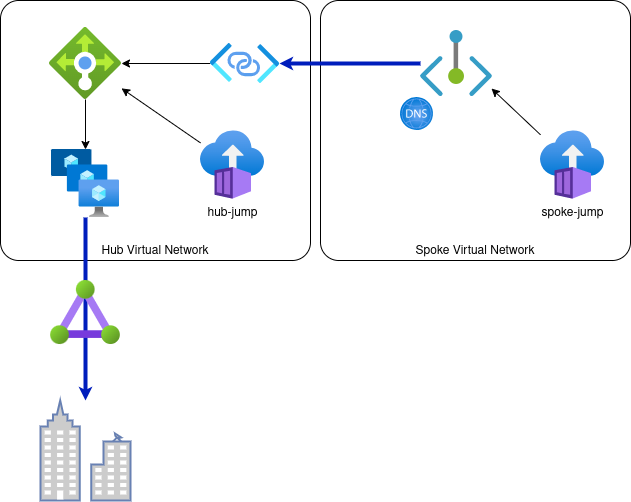

## TL;DR

What can be seen in this post:

- use a Load Balancer combined with a small sized VM scaleset (VMSS) configured with **iptables** to forward and masquerade incoming connections to 2 IP addresses which represent 2 on-premise servers; this installation is placed in a hub network that can be shared amount several spoke networks
- link this Load Balancer to another virtual network - without virtual network peering - by utilizing Private Link Service and a Private Endpoint which is placed in a spoke network
- use Azure Container Instances to connect into hub or spoke networks and test connections

## Context

For a scenario within a corporate managed virtual network, I [private linked the Azure Container Apps environment with its own virtual network and non-restricted IP address space](https://dev.to/kaiwalter/preliminary-private-linking-an-azure-container-app-environment-3cnf) (here Spoke virtual network) to the corporate Hub virtual network.


> _back then, there was no official icon for Container Apps Environments available, hence I used an AKS icon_

One challenge that had to be solved back then is how to let the workloads running in Azure Container Apps environment call back into an API Management instance in the Hub virtual network. To achieve that I [private linked the Application Gateway, that forwards to the API Management instance, into the Spoke virtual network](https://dev.to/kaiwalter/use-azure-application-gateway-private-link-configuration-for-an-internal-api-management-1d6o):


## A New Challenge

Just recently a new challenge came up: We needed to forward TCP traffic on a specific port to 2 specific - usually load balanced - servers in a downstream / connected on-premise network.

The first reflex was to try to put both IP addresses into a backend pool of a Load Balancer in the Hub virtual network. Then trying to establish a Private Endpoint in the Spoke virtual network to allow traffic from Azure Container Apps environment over private linking into the Load Balancer and then to the downstream servers. However some [limitations](https://learn.microsoft.com/en-us/azure/load-balancer/backend-pool-management#limitations) got in the way of this endeavor:

> Limitations
> - IP based backends can only be used for Standard Load Balancers
> - The backend resources must be in the same virtual network as the load balancer for IP based LBs
> - A load balancer with IP based Backend Pool can’t function as a Private Link service
> - ...

## Going Down the Rabbit Hole

As I usually _"Don't Accept the Defaults" (Abel Wang)_ or just am plain and simple stubborn, I tried it anyway - which in its own neat way also provided some more learnings, I otherwise would have missed.

To let you follow along I created a [sample repo](https://github.com/KaiWalter/azure-private-link-port-forward) which allows me to spin up an exemplary environment using [Azure Developer CLI](https://learn.microsoft.com/en-us/azure/developer/azure-developer-cli/overview) and [Bicep](https://learn.microsoft.com/en-us/azure/azure-resource-manager/bicep/overview?tabs=bicep).

> I like using **`azd`** together with **Bicep** for simple Proof-of-Concept like scenarios as I can easily `azd up` and `azd down` the environment without having to deal with state  - as with other IaC stacks.

**Learning 1:** I was not able to bring up the Load Balancer directly linked with the server IP addresses with [Bicep](https://github.com/KaiWalter/azure-private-link-port-forward/blob/main/infra/modules/loadbalancer/loadbalancer.bicep) in one go. [Deployment succeeded without error but backend pool just was not configured](https://stackoverflow.com/questions/75910542/backendaddresspool-in-azure-load-balancer-with-only-ip-addresses-does-not-deploy).

**Learning 2:** Deploying with CLI, configured the Load Balancer backend pool correctly ... but forwarding did not work, because ...

```shell
source <(azd env get-values)

az network lb delete -g $RESOURCE_GROUP_NAME --name ilb-$RESOURCE_TOKEN

az network lb create -g $RESOURCE_GROUP_NAME --name ilb-$RESOURCE_TOKEN --sku Standard \
--backend-pool-name direct \
--subnet $(az network vnet subnet show -g $RESOURCE_GROUP_NAME -n shared --vnet-name vnet-hub-$RESOURCE_TOKEN --query id -o tsv)

az network lb probe create -g $RESOURCE_GROUP_NAME --lb-name ilb-$RESOURCE_TOKEN -n direct --protocol tcp --port 8000

az network lb address-pool create -g $RESOURCE_GROUP_NAME --lb-name ilb-$RESOURCE_TOKEN -n direct \
--backend-address name=server65 ip-address=192.168.42.65 \
--backend-address name=server66 ip-address=192.168.42.66 \
--vnet $(az network vnet show -g $RESOURCE_GROUP_NAME  -n vnet-hub-$RESOURCE_TOKEN --query id -o tsv)

az network lb rule create -g $RESOURCE_GROUP_NAME --lb-name ilb-$RESOURCE_TOKEN -n direct --protocol tcp \
--frontend-ip LoadBalancerFrontEnd --backend-pool-name direct \
--frontend-port 8000 --backend-port 8000 \
--probe direct

az network lb show -g $RESOURCE_GROUP_NAME --name ilb-$RESOURCE_TOKEN
```

> `source <(azd env get-values)` sources all `main.bicep` output values generated by `azd up` or `azd infra create` as variables into the running script

**Learning 3:** ... specifying IP addresses together with a virtual network in the backend pool is intended for the Load Balancer to hook up the NICs/Network Interface Cards of Azure resources later automatically when these NICs get available. It is not intended for some generic IP addresses.

**Learning 4:** Anyway Azure Portal did not allow to create a Private Link Service on a Load Balancer with IP address configured backend pool. So it would not have worked for my desired scenario anyway.

## Other Options

- **Virtual Network Peering** Hub and Spoke is not an option as we
  - do not want to mix up corporate IP address ranges with the arbitrary IP addresses ranges of the various Container Apps virtual networks
  - want to avoid BGP/Border Gateway Protocol mishaps at any cost
- with a recently [**reduced required subnet size** for Workload profiles](https://learn.microsoft.com/en-us/azure/container-apps/networking#subnet) moving the whole **Azure Container Apps environment** or just the particular single Container App in question back to corporate IP address space would have been possible, but I did not want to give up this extra level of isolation this separation based on Private Link in and out gave us; additionally it would have required a new / separate subnet to keep it within network boundaries
- deploy this one containerized workload into the corporate VNET with **Azure App Service or Azure Functions**, but that would have messed up the homogeneity of our environment; additionally it would have required a new / separate subnet allowing delegation for these resources

## Bring In some IaaS and **iptables** Magic

Being a passionate **PaaS-first** guy, I usually do not want (or let other people need) to deal with infrastructure / **IaaS**. So for this rare occasion and isolated use case I decided to go for it and keep and eye out for a future Azure resource or feature that might cover this scenario - as with our DNS forwarded scaleset which we now can replace with [Azure DNS Private Resolver](https://learn.microsoft.com/en-us/azure/dns/dns-private-resolver-overview). For our team such a decision in the end is a matter of managing technical debt.

Making such a decision easier for me is, that this is a stateless workload. VMSS nodes as implemented here can recreated at anytime without the risk of data loss.

### Solution Overview

All solution elements can be found in this [repo](https://github.com/KaiWalter/azure-private-link-port-forward):



- `infra/modules/forwarder/*` : a VMSS / **VM Scaleset** based on a Ubuntu 22.04 image, configure and persist **netfilter** / **iptables**
- `infra/modules/forwarder/forwarder.bicep` : a **Load Balancer** on top of the VMSS
- `infra/modules/forwarder/forwarder-spoke-privatelink.bicep` : a **Private Link Service** linked to the Load Balancer
- `infra/modules/forwarder/forwarder-spoke-privatelink.bicep` : a **Private Endpoint** in the Spoke network connecting to the Private Link Server paired with a Private DNS zone to allow for name resolution
- `infra/modules/containergroup.bicep` : Azure Container Instances (**ACI**) in Hub and Spoke virtual networks to hop onto these network for basic testing

> general note: the sample repo is forwarding to web servers on port 8000 - for that I could have used (a layer 7) Application Gateway; however in our real world scenario we forward to another TCP/non-HTTP port, so the solution you see here should work for any TCP port (on layer 4)

### VM Scaleset

I chose an image which is supported for `enableAutomaticOSUpgrade: true` to reduce some of the maintenance effort; Ubuntu 22.10 was not yet supported

```
  imageReference: {
    publisher: 'canonical'
    offer: '0001-com-ubuntu-server-jammy'
    sku: '22_04-LTS'
    version: 'latest'
  }
```

> I want to try to convert to CBL Mariner to reduce image size sometime soon and update here

I chose the smallest feasible  VM SKU, but asked or monitoring team to keep an I on CPU+Disk+Memory utilization

```
  sku: {
    name: 'Standard_B1s'
    tier: 'Standard'
    capacity: capacity
  }
```

#### HealthExtension

I wanted the scaleset to know about "application's" health, hence whether the forwarded port is available:

```
  extensionProfile: {
    extensions: [
      {
        name: 'HealthExtension'
        properties: {
          autoUpgradeMinorVersion: false
          publisher: 'Microsoft.ManagedServices'
          type: 'ApplicationHealthLinux'
          typeHandlerVersion: '1.0'
          settings: {
            protocol: 'tcp'
            port: port
          }
        }
      }
    ]
  }
```

I had to learn, that this check is done by the extension from within the VM, hence I had to open up an additional **OUTPUT**:

```
iptables -t nat -A OUTPUT -p tcp -d 127.0.0.1 --dport $PORT -j DNAT --to-destination $ONPREMSERVER
```

#### cloud-init.txt

IP forwarding needs to be enabled, also on the outbound:

```
...
write_files:
- path: /etc/sysctl.conf
  content: | 
    # added by cloud init
    net.ipv4.ip_forward=1
    net.ipv4.conf.all.route_localnet=1
  append: true
...
runcmd:
- sysctl -p
...
```

I added a basic distribution of load to the 2 on-premise servers based on the last digit of the VMSS node's hostname:

```
if [[ $HOSTNAME =~ [02468]$ ]]; then export ONPREMSERVER=192.168.42.65; else export ONPREMSERVER=192.168.42.66; fi
```

#### cloud-init.txt / **iptables** configuration

To dig into some of the basics of **iptables** I worked through these 2 posts:
- <https://www.digitalocean.com/community/tutorials/iptables-essentials-common-firewall-rules-and-commands>
- <https://jensd.be/343/linux/forward-a-tcp-port-to-another-ip-or-port-using-nat-with-iptables>

```
# clear filter table
iptables --flush
# general policy : deny all incoming traffic
iptables -P INPUT DROP
# general policy : but allow all outgoing traffic
iptables -P OUTPUT ACCEPT
# allow traffic coming in on loopback adapter -- see -A OUTPUT -p tcp -d 127.0.0.1
iptables -A INPUT -i lo -j ACCEPT
# further allow established connection
iptables -A INPUT -m conntrack --ctstate ESTABLISHED,RELATED -j ACCEPT
# drop invalid connections
iptables -A INPUT -m conntrack --ctstate INVALID -j DROP
# allow incoming SSH for testing - could be removed
iptables -A INPUT -p tcp --dport 22 -m conntrack --ctstate NEW,ESTABLISHED -j ACCEPT
# allow outgoing connection to target servers from inside VMSS node
iptables -t nat -A OUTPUT -p tcp -d 127.0.0.1 --dport $PORT -j DNAT --to-destination $ONPREMSERVER
# allow incoming traffic from Load Balancer! - important!
iptables -t nat -A PREROUTING -s 168.63.129.16/32 -p tcp -m tcp --dport $PORT -j DNAT --to-destination $ONPREMSERVER:$PORT
# allow incoming traffic from Hub virtual network - mostly for testing/debugging, could be removed
iptables -t nat -A PREROUTING -s $INBOUNDNET -p tcp -m tcp --dport $PORT -j DNAT --to-destination $ONPREMSERVER:$PORT
# masquerade outgoing traffic so that target servers assume traffic originates from "allowed" server in Hub network
iptables -t nat -A POSTROUTING -d $ONPREMNET -j MASQUERADE
```

> I learned that I also could have used **nftables** or **ufw**, I just found the most suitable samples with **iptables**

### Load Balancer

Nothing special here.

> In our pretty locked-down environment I had to pair the internal Load Balancer with a Public IP address fronted Load Balancer to arrange outbound traffic for the VMSS instances. That configuration still needs to be replaced with a NAT gateway which in turn needs reconfiguration of our corporate virtual network setup. If there is something relevant to share, I will update here or create a separate post.

### Private Link Service

I got confused when I started using private linking a few months back: This service needs to be created in the virtual network of the service to be linked as a kind of pick-up point. So in my sample in the Hub virtual network.

### Private Endpoint & Private DNS Zone

Also pretty straight forward: I chose a zone `internal.net` which is unique in the environment and potentially not appearing somewhere else.

`forwarder-private-nic-to-ip.bicep` : this allows to resolve the private endpoints's private address with an extra deployment step over the NIC:

```
param pepNicId string

resource nic 'Microsoft.Network/networkInterfaces@2021-05-01' existing = {
  name: substring(pepNicId, lastIndexOf(pepNicId, '/') + 1)
}

output nicPrivateIp string = nic.properties.ipConfigurations[0].properties.privateIPAddress
```

It is injected after deploying the private endpoint to receive the private IP address for the DNS zone, as there is no linked address update possible as with regular Azure resource private endpoints:

```
module nic2pip 'forwarder-private-nic-to-ip.bicep' = {
  name: 'nic2pip'
  params: {
    pepNicId: pep.properties.networkInterfaces[0].id
  }
}

resource privateDnsZoneEntry 'Microsoft.Network/privateDnsZones/A@2020-06-01' = {
  name: 'onprem-server'
  parent: dns
  properties: {
    aRecords: [
      {
        ipv4Address: nic2pip.outputs.nicPrivateIp
      }
    ]
    ttl: 3600
  }
}
```

### Azure Container Instances

I use a publicly available image `hacklab/docker-nettools` which contains some essential tools like **curl** for testing and debugging.

In the containerGroup resource I overwrite the startup command to send this shell-like container into a loop so that it can be re-used for a shell like `az container exec -n $HUB_JUMP_NAME -g $RESOURCE_GROUP_NAME --exec-command "/bin/bash"` later.

```
  command: [
    'tail'
    '-f'
    '/dev/null'
  ]
```

### Other Gadgets

I use **azd** hooks to funnel e.g. `cloud-init.txt` or SSH public key `id_rsa` content into deployment variables - see `hooks/preprovision.sh`

```shell
#!/bin/bash

set -e

azd env set SSH_PUBLIC_KEY "$(cat ~/.ssh/id_rsa.pub)"
azd env set CLOUD_INIT_ONPREM "$(cat ./infra/modules/onprem-server/cloud-init.txt | base64 -w 0)"
azd env set CLOUD_INIT_FWD "$(cat ./infra/modules/forwarder/cloud-init.txt | base64 -w 0)"
```

> converting to base 64 avoids having to deal with line breaks or other control characters in the variables

After the deployment I immediately stop Azure Container Instances to not induce cost permanently - see `hooks/postprovision.sh` ...

```shell
#!/bin/bash

set -e

source <(azd env get-values | grep NAME)

az container stop -n $HUB_JUMP_NAME -g $RESOURCE_GROUP_NAME --verbose
az container stop -n $SPOKE_JUMP_NAME -g $RESOURCE_GROUP_NAME --verbose
```

... which and then spin up for testing on demand

```shell
source <(azd env get-values | grep NAME)
az container start -n $SPOKE_JUMP_NAME -g $RESOURCE_GROUP_NAME
az container exec -n $SPOKE_JUMP_NAME -g $RESOURCE_GROUP_NAME --exec-command "curl http://onprem-server.internal.net:8000"
az container stop -n $SPOKE_JUMP_NAME -g $RESOURCE_GROUP_NAME
```

`source <(azd env get-values | grep NAME)` is a simple way to source some **azd** / **Bicep** deployment outputs into shell variables.

## Deployment

## Preparation

This setup assumes it works with `~/.ssh/id_rsa` key pair - to use other key pairs adjust `./hooks/preprovision.sh`. If you don't already have a suitable key pair, generate one or modify the preprovision script to point to another public key file:

```shell
ssh-keygen -m PEM -t rsa -b 4096
```

Login to your subscription first with Azure CLI and Azure Developer CLI:

```shell
az login
azd login
azd init
```

> be sure to set Azure CLI subscription to same subscription with `az account set -s ...` as specified for `azd init`

Deploy

```shell
azd up
```

Check, that connection to sample server is working from within Hub network directly:

```shell
source <(azd env get-values | grep NAME)
az container start -n $HUB_JUMP_NAME -g $RESOURCE_GROUP_NAME
az container exec -n $HUB_JUMP_NAME -g $RESOURCE_GROUP_NAME --exec-command "wget http://192.168.42.65:8000 -O -"
az container exec -n $HUB_JUMP_NAME -g $RESOURCE_GROUP_NAME --exec-command "wget http://192.168.42.66:8000 -O -"
```

Check, that connection to sample servers is working from over Load Balancer within Hub network directly:

```shell
source <(azd env get-values | grep -E 'NAME|TOKEN')
az container start -n $HUB_JUMP_NAME -g $RESOURCE_GROUP_NAME
ILB_IP=`az network lb list -g $RESOURCE_GROUP_NAME --query "[?contains(name, '$RESOURCE_TOKEN')].frontendIPConfigurations[].privateIPAddress" -o tsv`
az container exec -n $HUB_JUMP_NAME -g $RESOURCE_GROUP_NAME --exec-command "wget http://$ILB_IP:8000 -O -"
```

Check, that connection to sample servers is working from Spoke network

```shell
source <(azd env get-values | grep NAME)
az container start -n $SPOKE_JUMP_NAME -g $RESOURCE_GROUP_NAME
az container exec -n $SPOKE_JUMP_NAME -g $RESOURCE_GROUP_NAME --exec-command "curl http://onprem-server.internal.net:8000"
```
