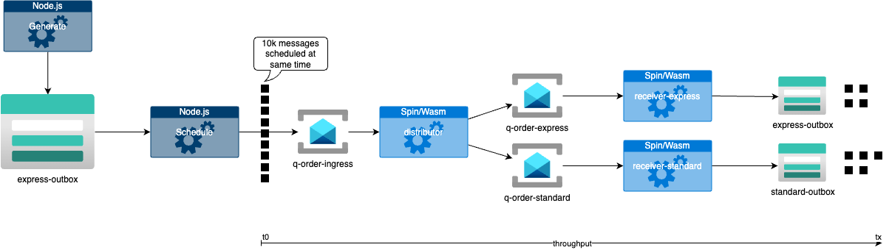

## TL;DR

In this post I want to illustrate, whether a WebAssembly (aka Wasm) framework like [Spin](https://github.com/fermyon/spin) can already be utilized on Kubernetes in coexistency with existing workloads using [SpinKube](https://www.spinkube.dev/).

## Motivation

In recent posts - [Comparing Azure Functions vs Dapr throughput on Azure Container Apps](https://dev.to/kaiwalter/comparing-azure-functions-vs-dapr-on-azure-container-apps-2noh) and [How to tune Dapr bulk publish/subscribe for maximum throughput](https://dev.to/kaiwalter/how-to-tune-dapr-bulk-publishsubscribe-for-maximum-throughput-40dd) - I compared throughput of the same asynchronous message distribution scenario with various flavors of .NET deployments (Dapr, Functions) on Azure Container Apps.

Observing the space of Wasm on the back end now for a while, I was wondering whether the same scenario already could be achieved and which of the suggested benefits are in reach to be leveraged. Those benefits being faster scalability and higher density as compiling [WASI](https://github.com/Wasm/WASI)-compatible code into a Wasm module potentially produces a smaller artifact then regular OCI containers (still containing fragments of an OS even in the smallest `distroless` variants).

> We explored the capabitlies in a team - hence in this post from now on I use **we** and **our**.

## Test Environment

As the Wasm ecosystem for our kind of usage is still ramping up and not all capabilities are present yet to "go all in" and migrate complete workloads, the question is, how to utilize Wasm on the back end in coexistence with existing workloads selectively.

In our environment many of the enterprise-ish workloads are hosted on Kubernetes. To get Kubernetes or rather `containerd` executing Wasm, a so called [containerd Wasm Shim](https://github.com/deislabs/containerd-wasm-shims?tab=readme-ov-file#shims) is required which itself utilizes [RunWasi](https://github.com/containerd/runwasi).

### Programming Languages

To be more flexible regarding the programming languages available for such a test scenario and to have a good-enough **developer-inner-loop** experience, we turned to [Spin](https://github.com/fermyon/spin). Of the [languages available](https://github.com/fermyon/spin?tab=readme-ov-file#language-support-for-spin-features) we used **Rust** to get a feeling for maximum scaling & density capabitlies and **TypeScipt/Node.js** to see behavior with a more runtime-heavy environment - as our prefered choice **.NET** in spring 2024 was not yet supporting a setup like that good enough.

### Cloud Resources

Currently Spin does not feature all [triggers and APIs](https://github.com/fermyon/spin?tab=readme-ov-file#language-support-for-spin-features) required to get to a comparable environment as in my previous posts, we leveraged [Dapr](https://dapr.io/) to connect the **Spin** application with cloud resources using **HTTP trigger** and **Outbound HTTP API**.

### Dapr Shared

When deploying Spin runtime with regular Kubernetes primitives like deployment/service/..., Dapr obviously can be leveraged in its default sidecar mode. Ultimate density with Spin is reached by getting some of this primitives out of the way - hence SpinKube with its own [SpinOperator](https://github.com/spinkube/spin-operator). As SpinOperator does not support injecting side-cars yet, [Dapr Shared](https://github.com/dapr-sandbox/dapr-shared) is used, which provides Dapr being hosted in a Kubernetes daemonset or deployment. That additionally enables a higher cardinality of Dapr vs (Spin) App: sidecar is a 1:1 relation while with Dapr Shared a 1:n relation can be achieved - contributing further to the higher density capabitlies that Wasm itself offers.

### Test Flow

The flow corresponds to the other 2 posts with minor adjustments:

- local TypeScript application generates test data set e.g. with 10k orders/messages and places it in a blob storage (using a local Dapr output binding) - this is done to always feed the same shape of data into the test flow and hence provide a similar processing stream regardless of tech stack being tested
- for one test run local TypeScript application loads this test data set from blob storage, splits into single messages and schedules these messages for a specified time in to the future to get activated all at once basically simulating, that a bulk of orders where placed on your doorstep to be processed at once
- **distributor** endpoint of sample service receives incoming messages over a Dapr input binding - not pub/sub, not bulk to cause as much of erratic traffic as possible - and then decides whether to put the messages on a queue for virtual `express` or `standard` orders again using a Dapr outbound binding
- **receiver** endpoint for either a `express` or `standard` receives incoming message and places it in a blob object for each message
- the throughput is measured from time of schedule until all generated messages are written in blob storage

Compared to arbitrarily hammering on a HTTP endpoint to evaluate performance, latency, ... this approach is intended to observe the behavior of the tech stack used within a certain environment, checking whether it is sensitive to any outside influences or side-effects or itself inflicts such for other components.

---

## Observations

Detailed setup and code can be found in [this repository](https://github.com/ZEISS/enterprise-wasm) and shall be explained in further depth in coming posts. For now I want to share some high level observations.

1. comparing **Spin-Rust** with **Warp-Rust** throughput is noticable better; even when operating Warp-Rust with classic containers on Azure **DS2_v2** VM SKU nodes while running Spin-Rust on **~60% cheaper D2pds_v5** (also leveraging on the strength of Wasm that it can be moved to nodes with a different architecture without the need to explicitly building and pushing a dedicated set of platform specific OCI containers)
1. when building **Warp-Rust** into a [stripped down static container](https://github.com/ZEISS/enterprise-wasm/blob/main/samples/warp-dapr-rs/Dockerfile.static) comparable results can be achieved which suggests, that packing size impacts scaling capabilities
1. comparing **Spin-TypeScript** with **Express-TypeScript** throughput is matched or only slightly better suggesting that runtime heavy languages languages/stacks like JavaScript, .NET, Java, ... cannot yet fully exploit Wasm potentials (as of spring 2024); but again, operating Express-TypeScript on Azure **DS2_v2** VM SKU nodes while running Spin-TypeScript on **~60% cheaper D2pds_v5** which is a cost benefit in itself
1. [.NET 7 with Spin SDK](https://github.com/ZEISS/enterprise-wasm/tree/main/samples/spin-dapr-dotnet) is not yet a serious contender - let's check again with .NET 8 or 9

## Disclaimers

1. as the goal has been to measure scaling behavior of a Spin App or its corresponding contender in isolation, we did not dynamically scale Dapr Shared replicas, setting them on a fixed replica count to handle as much incoming messages as possible
1. results could possibly change if we would enhance our relatively plain AKS setup with improved networking and load balancing e.g. by using Cillium
1. using KEDA HTTP scaling potentially also could yield different results due to a closer provisioned vs required replicas ratio
1. comparing workloads Express vs Spin or Warp vs Spin is conducted on the same cluster, with a dedicated `classic` or `wasm` node pool to show coexistency capabilities and to ensure a clean baseline

## Conclusion

The observations stated here shall be considered **preliminary**. There is still a lot of movement in that space. Adding further capabilities into Wasm modules like observability or improving runtime compatibility may result in absorbing some of the density or performance advantages Wasm modules currently here show to have. Gains like cutting down on multi-platform builds and image retention already speak for Wasm on the back end. Tooling (although Spin and its Fermyon Cloud ecosystem is a fantastic closed loop offering for Wasm modules), developer inner and outer loop definitely need to mature before Wasm can be fully exploited for enterprise workloads and compete to the current main stream stacks.

---

## Mentions

- the Fermyon guys Radu, Justin, Danielle, Rajat, Mikkel, Matt for entertaining and supporting us with our thoughts and setup
- Ralph from Microsoft for providing context and calibration
- [salaboy](https://github.com/salaboy) for helping to get [Dapr Shared](https://github.com/dapr-sandbox/dapr-shared) into a state that it can be utilized for our use case
