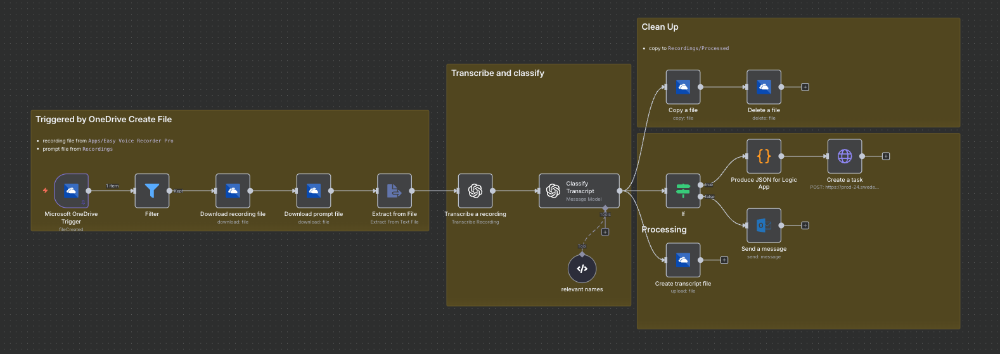
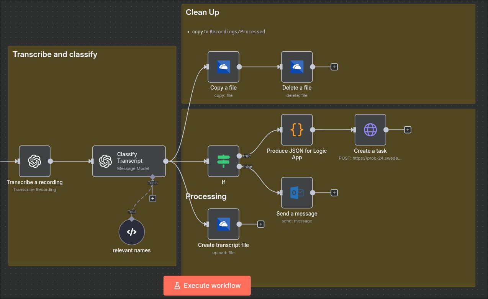
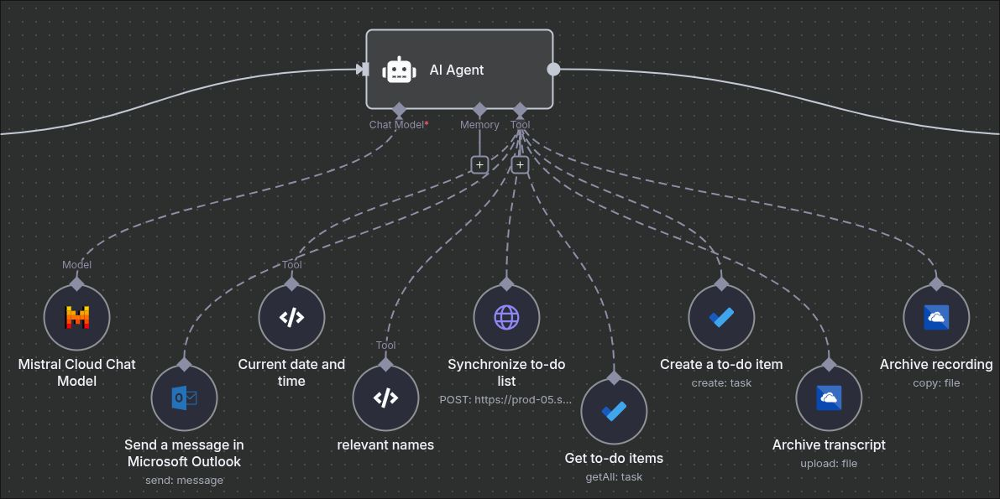
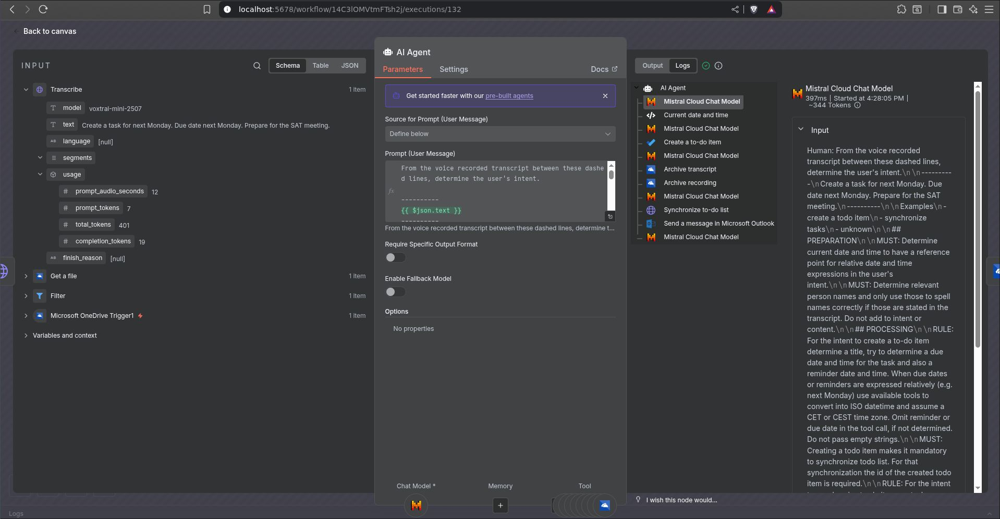

I am out, mostly in the mornings for a walk or run, and I just want to drop a thought or a task immediately. Sometimes even complete sections of an upcoming presentation. Or rushing between meetings, the same: Just drop a voice recording and have it turned into a task or just as a note into my email inbox.

That is my use case. Plain and simple.

For that I started using [n8n](https://n8n.io) a while back. A bit clumsy, but it worked. I had a flow running in the cloud, triggered by a new file in OneDrive, which downloaded the file, transcribed it using OpenAI Whisper API, then classified the intent using GPT-4.1-mini and based on that either created a task or sent an email to myself with the transcription.

> In case that sounds familiar: Yes, I converted that flow with Dapr Agents already, decribed in [this post](https://dev.to/kaiwalter/dipping-into-dapr-agentic-workflows-fbi) - [so skip that part](#improving-n8n).



How it works:

- on my Android phone I use the paid version of _Easy Voice Recorder Pro_ which allows to automatically upload into a predefined _OneDrive_ folder (which is `/Apps/Easy Voice Recorder Pro`)
- the recording is downloaded by the n8n flow on a trigger, when a file is created in that folder
- before downloading, to be safe and not crash the transcription unnecessarily, the flow filters on `audio/x-wav` or `audio/mpeg` MIME types
- additionally, the flow downloads a prompt text file from OneDrive which contains the instructions for classifying the intent in the transcription; I wanted to be on OneDrive, so I can modify it easily without having to touch the flow
- then transcribe using OpenAI Whisper API
- with the transcription and the prompt run through a model like `GPT-4.1-MINI`
- that classification step also has access to a simple tool - referenced in the prompt: a list of relevant person and other entity names to make the transcription more precise
- based on the intent resolved then either create a task (using a webhook, as I did not want to mess around in our corporate environment) or just send an email to my corporate-self with the plain transcription
- as part of housekeeping, copy the file to an archive folder and delete the original

That worked pretty well. I especially liked the capability of n8n to copy runtime data of a particular execution into the editor, which makes mapping and debugging so much easier. I moved the cloud-based flow to one to my own machines, so I could run it basically for free (download it, import it from file, rewire cloud credentials).

Since the previous post I explored Dapr Agents some more and also did an exemplary implementation with [Microsoft Agent Framework](https://github.com/microsoft/agent-framework) and [.NET Aspire](https://learn.microsoft.com/en-us/dotnet/aspire/) in [this repository](https://github.com/KaiWalter/agent-framework-voice2action). Just to get a better understanding on the relevance of prompts, tools and the clean segregation between orchestration and agents or MCP servers.

During all that time I kept the n8n flow running as I (myself) was not able to muster comparable fulfillment reliability with the other implementations. Then a few days ago I watched a guy using an "AI Agent" node in n8n which exaclty looked like something to even more simplify my flow while adding more capabilities and flexibility.

## Improving the flow with n8n AI Agent<a name="improving-n8n"></a>

In the previous flow I ran the transcription through a model to classify the intent. From that structured output I wired up a set of tasks to fulfill the intent. That worked, but was a bit clumsy and not very flexible. If I wanted to add more capabilities, I had to modify the flow and add more branches.



With the AI Agent node I can do all that in one single node. The node has access to the transcription, the prompt and a set of tools. Based on that it can decide what to do.



As most of the tools connected describe their capabilities to a certain proper degree, the prompt can be simplified. I just have to make sure that the agent understands what it can do and how to use the tools. The prompt I am using is this one:

```markdown
From the voice recorded transcript between these dashed lines, determine the user's intent.

---

## {{ $json.text }}

---

Examples

- create a todo item
- synchronize tasks
- unknown

## PREPARATION

MUST: Determine current date and time to have a reference point for relative date and time expressions in the user's intent.

MUST: Determine relevant person names and only use those to spell names correctly if those are stated in the transcript. Do not add to intent or content.

## PROCESSING

RULE: For the intent to create a to-do item determine a title, try to determine a due date and time for the task and also a reminder date and time. When due dates or reminders are expressed relatively (e.g. next Monday) use available tools to convert into ISO datetime and assume a CET or CEST time zone. Omit reminder or due date in the tool call, if not determined. Do not pass empty strings.

MUST: Creating a todo item makes it mandatory to synchronize todo list. For that synchronization the id of the created todo item is required.

RULE: For the intent to synchronize to-do items or tasks retrieve all open to-do items and initiate a synchronization with the id of each to-do item.

RULE: Only if the intent bears more content than a simple command like "synchronize tasks", archive the transcript and archive the recording file.

RULE: If user's intent can be fulfilled with one of the tools and the input information for the tool is sufficient, do not ask for approval and just proceed and conclude the request.

## CONCLUSION

MUST: In any circumstance conclude by sending a summary email.
```

### Some tweaks

- for archiving the transcript I used the OneDrive upload file node and hence I had to adjust the tool description
- same for archiving the recording file, where I used the OneDrive copy file node
- I cannot (and shall not) connect n8n to my company resources (like to-do lists) directly, hence I use a webhook to trigger a protected synchronization flow to synchronize the tasks with my Outlook tasks
- I used a simple code node to return the current date and time in ISO format, so the agent can use that to resolve relative date and time expressions
- also I added a code node to provide a list of relevant person names, which the agent can use to spell names correctly in the transcription (yeah you get that with German names in an english recording)
- for a start I did not make use of agent memory as each individual flow is rather ephemeral at the moment

### Switching to Mistal API 🇪🇺

For the agent I switched from OpenAI to Mistal API, as I wanted to try that out. With `mistral-medium-latest` I was able to produce reliable results.

There is no Mistral node for speech to text in n8n yet, but I was able to use the HTTP request node to call the API. Nice thing in n8n is, that HTTP request node has a notion of the many credentials n8n supports, so I could use my existing Mistral credentials without the need to figure out authentication headers and so on.

Also here I observed, that the model is not so overly crucial to the result anymore. As with the other frameworks I tried, the prompt and the tools are much more relevant to get a good result.

### Cherry on top

I particularly like the execution log of the AI Agent node. It shows the reasoning steps, the tool calls and the final response. That is super helpful to understand what is going on and why.



---

## Conclusion

I like the simplicity of the new flow. It is much easier to understand and to modify. If I want to add more capabilities, I just have to add more tools and adjust the prompt. No need to modify the flow itself.

In terms of implementation effort and speed I easily outpace my other agent framework implementations, although there I heavily build on specification driven agentic coding. To be fair I have to say, that with those I am mainly targeting enterprise scenarios, where many more aspects have to be considered. Anyway for this personal use case n8n is a great fit.

**Kudos to n8n !!!**
